**PE盘的制作与使用**

  -----------------------------------------------------------------------
  **TLDR（省流）**

  -----------------------------------------------------------------------

[点我，下载最新版ventoy](https://mirrors.nju.edu.cn/github-release/ventoy/Ventoy/LatestRelease/#:~:text=ventoy%2D1.0.97%2D-,windows.zip,-16707752)

解压

直接执行 Ventoy2Disk.exe ，选择磁盘设备，然后**直接**点击 安装
按钮即可（**什么设置都不用动**）。

+-----------------------------------+-----------------------------------+
| {width="2.7083333333333335in" | png){width="2.7083333333333335in" |
| height="2.0729166666666665in"}    | height="2.0625in"}                |
|                                   |                                   |
| 安装前                            | 安装后                            |
+-----------------------------------+-----------------------------------+

你的U盘会分为两个分区，其中有个分区可能隐藏了，也可能会显示出来，但这都不重要，你只需要关注**容量最大**的那个分区（**下称分区A**），另一个分区**千万不要动！！**

到【[Win10_and_11 \|
特菈的杂货铺](https://index.dustella.net/System_Images/Win10_and_11)】里下载你需要的系统镜像，复制到**分区A**中（任意位置）

到【[WinPE \|
特菈的杂货铺](https://index.dustella.net/System_Images/WinPE)】里下载【**WEPE.iso**】，复制到**分区A**中（任意位置）

做好了！

将PE盘接入电脑。关机，然后开机，同时狂按某个快捷键，不同品牌电脑的快捷键不同，可自行百度或查阅[摘录自msdn的教程文章](https://e0w6uca6qjf.feishu.cn/wiki/RYctwD2DPiaP9pkpj8lcYfIanRb?fromScene=spaceOverview#RCXAdwaORoMYhxxx52GcLw9Jnxf)

在接下来的菜单中，选择你的U盘，菜单项名称**一般**以UEFI：开头，后面是你的U盘型号

做完上步后，如果你遇到了[PE盘的制作与使用](https://e0w6uca6qjf.feishu.cn/wiki/QPcJwWwKWiUbdZkTfHUc7PnOnkh?fromScene=spaceOverview#Zz84dau8XoLQGhx1ZxCcsSqanTc)（点击链接查看图片），那么有两种选择

进bios把安全启动关了，由于不同品牌的bios界面不同，请自行以【\<品牌名\>
bios 安全启动】为关键词百度搜索

将ventoy的key写进可信区中，参见[PE盘的制作与使用](https://e0w6uca6qjf.feishu.cn/wiki/QPcJwWwKWiUbdZkTfHUc7PnOnkh?fromScene=spaceOverview#G9MRdwv3JowMeZxbFrLc9tGGnCe)（点击链接以跳转）

接下来是一个目录选择界面，显示的就是**分区A**的目录，你可以在这里面选择你要加载的镜像

如果要安装系统，你可以直接加载系统镜像，使用原版安装

如果要系统维护（如分区、修复引导等），请选择加载PE镜像

选择完镜像后，你大概率会进入二级菜单，如图[PE盘的制作与使用](https://e0w6uca6qjf.feishu.cn/wiki/QPcJwWwKWiUbdZkTfHUc7PnOnkh?fromScene=spaceOverview#GTKgdlGaDouEyexbnp2clGU2nec)（点击查看），无脑选第一项【normal
mode】就行了，如果失败，再依次往下尝试

好了！接下来就不在本文讨论的范畴内了。请移步本系列剩余教程\~

**制作方法**

由于市面上的PE系统五花八门，这里仅介绍基于Ventoy的最佳实践。

**Ventoy**

+-----------------------------------------------------------------------+
| 简单来说，[Ventoy]                                                    |
| (https://www.ventoy.net/cn/index.html)是一个制作可启动U盘的开源工具。 |
|                                                                       |
| 有了Ventoy你就无需反复地格式化U盘，你只需要把 ISO/WIM/IMG/VHD(x)/EFI  |
| 等类型的文件直接拷贝到U盘里面就可以启动了，无需其他操作。             |
|                                                                       |
| 你可以一次性拷贝很多个不同类型的镜像文件，Ventoy                      |
| 会在启动时显示一个菜单来供你进行选择 (参见                            |
| [截图](https://www.ventoy.net/cn/screenshot.html))。\                 |
| 你还可以在 Ventoy 的界面中直接浏览并启动本地硬盘中的                  |
| ISO/WIM/IMG/VHD(x)/EFI 等类型的文件。                                 |
|                                                                       |
| Ventoy 安装之后，同一个U盘可以同时支持 x86 Legacy BIOS、IA32          |
| UEFI、x86_64 UEFI、ARM64 UEFI 和 MIPS64EL UEFI                        |
| 模式，同时还不影响U盘的日常使用。                                     |
|                                                                       |
| Ventoy 支持大部分常见类型的操作系统                                   |
| （Windows/WinPE/Linux/ChromeOS/Unix/VMware/Xen \...）\                |
| 目前已经测试了各类超过 **1100+**                                      |
| 个镜像文件([列表](https://www.ventoy.net/cn/isolist.html))。 支持     |
| [d                                                                    |
| istrowatch.com](http://distrowatch.com/dwres.php?resource=popularity) |
| 网站上收录的 **90%+**                                                 |
| 的操作系统([列表](https://www.ventoy.net/cn/distrowatch.html))。      |
+-----------------------------------------------------------------------+

**Windows 系统安装 Ventoy ------ 图形界面**

下载安装包，例如 ventoy-1.0.00-windows.zip 然后解压开。\
直接执行 Ventoy2Disk.exe 如下图所示，选择磁盘设备，然后点击 安装
按钮即可。

+-----------------------------------+-----------------------------------+
| {width="2.7083333333333335in" | png){width="2.7083333333333335in" |
| height="2.0729166666666665in"}    | height="2.0625in"}                |
|                                   |                                   |
| 安装前                            | 安装后                            |
+-----------------------------------+-----------------------------------+

**安装包内 Ventoy 版本**：当前安装包中的Ventoy版本号\
**设备内部 Ventoy
版本**：U盘中已安装的Ventoy版本号，如果为空则表示U盘内没有安装Ventoy\
**左侧显示的
MBR/GPT**：用户当前选择的分区格式，可以在选项中修改，只对安装过程有效。\
**右侧显示的 MBR/GPT**：设备当前使用的分区格式
（也就是当初安装Ventoy时选择的分区格式），如果U盘内没有安装Ventoy，则会显示空。\
**左侧显示的
exFAT/NTFS/FAT32**：用户当前选择的Ventoy分区文件系统类型，可以在选项中修改，只对安装过程有效。\
**右侧显示的
exFAT/NTFS/FAT32**：当前设备中Ventoy分区的文件系统类型。如果当前设备中没有安装Ventoy，则显示为空。\
**安装**：把Ventoy安装到U盘，只有第一次的时候需要，其他情况就只需要升级即可\
**升级**：升级U盘中的Ventoy版本，升级不会影响已有的ISO文件

**如果Ventoy2Disk.exe安装或升级一直提示失败，请参考
[说明](https://www.ventoy.net/cn/doc_ventoy2disk.html)**

**Ventoy可以安装在U盘上，也可以安装在本地硬盘上。为防止误操作，默认只会列出U盘，你可以勾选
配置选项\--\>显示所有设备 这个选项。**\
**此时会列出包括系统盘在内的所有磁盘，但此时你自己务必要小心操作，不要选错盘。**

**MBR/GPT
分区格式选项只在安装时会用，升级的时候是不管的，也就是说升级是不会改变现有分区格式的，必须重新安装才可以。**

**安装完之后，U盘存放镜像文件的Ventoy分区也可以再次手动格式化。支持
exFAT/FAT32/NTFS/UDF/XFS/Ext2/3/4 系统。**\
**对于普通U盘建议使用exFAT文件系统，对于大容量的移动硬盘、本地硬盘、SSD等建议使用NTFS文件系统。**

**接下来**

将一些常用的PE镜像和系统镜像拷到U盘里就行了，这里列举一些资源：

**PE镜像**

[微PE工具箱 - 超好用的装机维护工具](https://www.wepe.com.cn/)

  ------------------------------------------------------------------------------------------------
  跨时代的PE工具箱，装机维护得力的助手，最后的救命稻草。化繁为简，小材大用，一键安装，极速启动。

  ------------------------------------------------------------------------------------------------

[FirPE 维护系统](https://firpe.cn/page-247)

  ----------------------------------------------------------------------------------------------------------------------------------------------------------
  FirPE 是一款系统预安装环境（Windows
  PE），它具有简约、易操作等特点，使用起来十分人性化。以U盘作为使用载体，空间更为充分，携带更为方便。同时整合各种装机必备工具，有效提高系统安装效率。FirPE
  将为大家带来全新的用户体验！

  ----------------------------------------------------------------------------------------------------------------------------------------------------------

[HotPE - 一个纯净、强大、优雅的PE工具箱](https://www.hotpe.top/)

  ----------------------------------------------------------------------------------------------------------------------------------------------------------------------------------------------------------------
  一个纯净、强大、优雅的开源Win11PE，**支持上网、声音、远程、下载**、HotPE模块、Edgeless插件、MTP、RNDIS、Legacy、UEFI、M.2、NVME、USB设备弹出、搜索功能、MSI、BitLocker解锁、网络共享、U盘和本地启动、生成ISO等
  HotPE2.6正式版已经发布，采用最新的Win11 内核，欢迎下载使用！ 内置主流的无线

  ----------------------------------------------------------------------------------------------------------------------------------------------------------------------------------------------------------------

待补充\....（老东西@吴恺诚@韩杰炜@QLozan看看有没有推荐的，可以在旁边评论）

**系统镜像**

直接上
[https://next.itellyou.cn/Original](https://next.itellyou.cn/Original/)
下载就行

或者也可以到 [Home \| 海上修机师的超级仓库](https://index.0w0.al/)
去下载

**食用方法**

**UEFI模式安全启动操作说明**

Ventoy 1.0.07 版本开始支持 Secure Boot (安全启动)，在
Ventoy2Disk.exe和Ventoy2Disk.sh 中增加了一个安全启动的选项。\
对于 Ventoy2Disk.exe 是菜单 \"配置选项\" \-\--\> \"安全启动支持\"\
对于 Ventoy2Disk.sh 是 -s 选项。\
\
**从 1.0.76 版本开始，这个选项默认是开启的。**
理论上开启这个选项之后，不管BIOS里面的安全启动是开启的还是关闭的，都可以正常启动。\
当BIOS里的安全启动开启时，正常情况下首次启动会出现类似下面这样的界面，**请按照下面的操作说明操作一遍（只需一次）。**

{width="5.75in"
height="4.104166666666667in"}

不过这个安全启动的方案不是非常的完美，开启后有可能会导致在一些个别的机器上（常见于一些较老的联想电脑）不管BIOS里安全启动是开启还是关闭，都不能正常启动。（比如最常见的一类是显示
Linpus lite xxx）

如果出现错误则说明这个安全启动的方案不兼容你的机器。
此时，你必须关闭这个选项，取消勾选这个选项，使用 Ventoy2Disk
重新升级一次Ventoy，同时必须在BIOS中关闭安全启动。这两个条件必须同时满足才可以正常使用
Ventoy。

**Ventoy Secure Boot （安全启动）操作说明**\
1、以下操作只需要在第一次启动Ventoy时做一遍即可，以后再重启、或者Ventoy升级等都不需要再做了。\
2、有 Enroll Key 和 Enroll Hash 两种方式，在你的电脑上哪种可用就使用哪种

**Enroll Key**

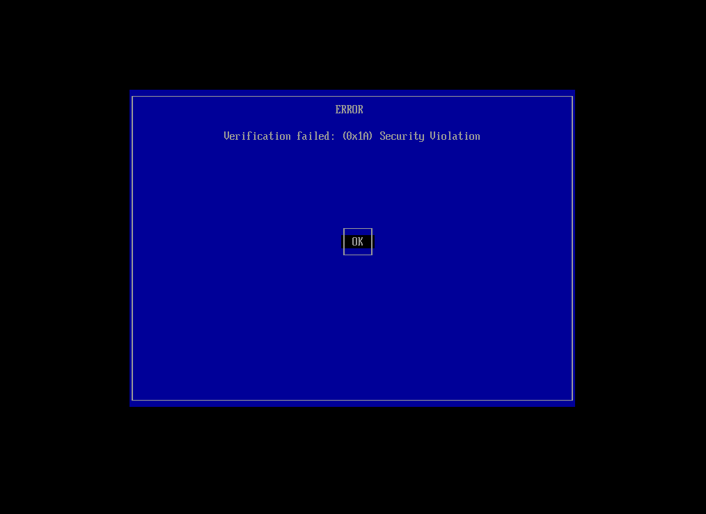{width="5.75in" height="4.1875in"}

**Enroll Hash**

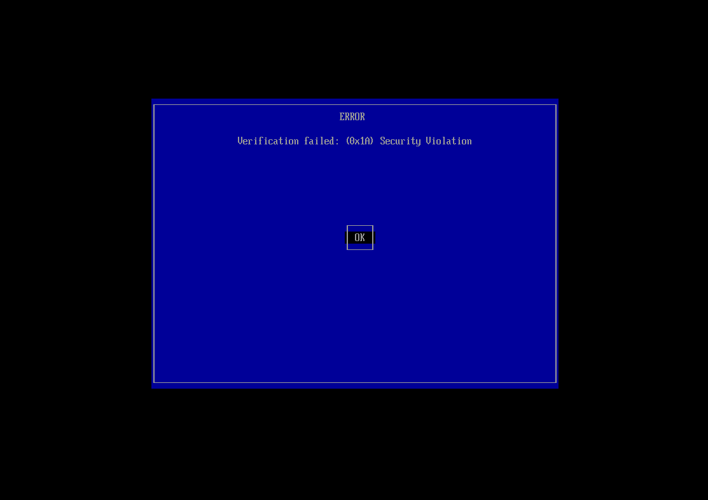{width="5.75in"
height="4.052083333333333in"}

**二级启动菜单**

**背景介绍**

为了兼容一些特殊的ISO文件和电脑主板，Ventoy
提供了几种特殊的启动模式。比如：
[WIMBOOT](https://www.ventoy.net/cn/doc_wimboot.html)
模式、[GRUB2](https://www.ventoy.net/cn/doc_grub2boot.html) 模式、
[MEMDISK](https://www.ventoy.net/cn/doc_memdisk.html) 模式。\
在之前的版本中只能通过快捷键来启用这些特殊模式。比如按 Ctrl+w 使用
WIMBOOT 模式，按 Ctrl+r 使用 GRUB2 模式等。\
为了方便使用，从 1.0.80 版本开始，Ventoy
提供了一个二级启动菜单。可以直接选择使用正常模式还是上述特殊模式启动。\
快捷键的方式仍然有效，而且如果提前按了相关快捷键，或者镜像文件名中有特殊的
[标识](https://www.ventoy.net/cn/doc_name_identifier.html)，则不会再显示此菜单。\
\
另外，如果你不想显示此二级启动菜单，还是想和之前一样。你可以通过
[全局控制插件](https://www.ventoy.net/cn/plugin_control.html) 中的
VTOY_SECONDARY_BOOT_MENU 参数来禁用。\
\
**注意：在任何情况下都优先使用 normal mode
来启动，只有启动遇到问题时才需要尝试其他模式。**

**截图**

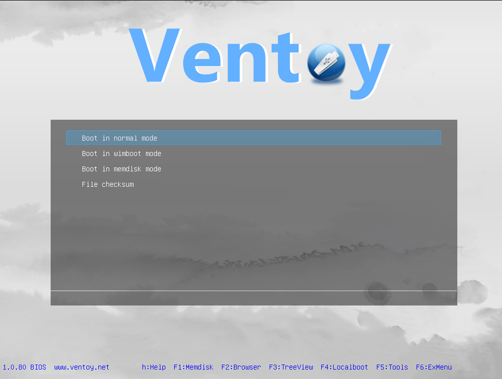{width="5.75in"
height="4.333333333333333in"}

**接下来**

请移步其他教程（如windows安装，引导修复等）

**Ventoy常见问题**

**. 安装类问题**

**Ventoy 能否安装到本地硬盘中？**

可以！ Ventoy 可以安装在
U盘、移动硬盘、SD卡、普通硬盘、SSD、NVMe盘等设备上。\
在 Windows 系统中，为防止误操作，Ventoy2Disk.exe 默认只会列出 USB
接口类型的设备。\
你可以勾选 配置选项 \--\> 显示所有设备
这个选项，此时就会列出所有接口类型的设备（包括C盘），但此时你自己务必要小心操作，不要选错盘。\
在 Linux
系统中，安装时需要用户自己指定安装设备。可以指定U盘，也可以是本地硬盘等。\
\
**需要特别注意的是，不管安装在U盘还是硬盘，都会重新分区、格式化，整个盘的数据都会被清除，请慎重操作。**

**Ventoy2Disk.exe无法列出我的U盘**

在Windows系统中某一些进程会占用住U盘导致Ventoy2Disk无法获得U盘的控制权，从而无法列出设备。下面是已经确认过的会导致问题的进程。请检查系统中是否存在。\
Paragon ExtFS for Windows\
ParagonMounter\
DokanMounter\
ext2fsd\
extservice\
DiskGenius\
DSAService.exe (Intel® Driver & Support Assistant).

**Windows下安装Ventoy总是失败**

请参考 [Ventoy2Disk.exe
安装失败处理方法](https://www.ventoy.net/cn/doc_ventoy2disk.html)

**Windows下升级Ventoy总是失败**

请参考 [Ventoy2Disk.exe
升级失败处理方法](https://www.ventoy.net/cn/doc_fail_update.html)

**我可以重新格式化存放ISO文件的分区吗 ?**

可以！ 你可以把存放ISO文件的分区重新格式化为
FAT32/NTFS/UDF/XFS/Ext2/Ext3/Ext4
文件系统。格式化的时候唯一的要求是簇大小不能小于 2048\
你可以使用以下命令来进行格式化: （注意这里的盘符 x: 和 /dev/sdb1
只是个例子，千万不能照抄，要按照实际的磁盘对应的盘符来）\
Windows格式化为NTFS：format x: /fs:ntfs /q\
Windows格式化为UDF：format x: /fs:udf /q\
Linux格式化为EXT4：sudo mkfs -t ext4 /dev/sdb1\
Linux格式化为XFS：sudo mkfs -t xfs /dev/sdb1

**第二个 EFI 分区能否隐藏？**

如果安装 Ventoy 时选择的是 MBR 分区格式，则首先我们要了解 Windows
系统自身的一个限制。\
在 Win7/8/8.1 以及早期的 Win10 版本中，对于
U盘，系统只会显示出第1个分区。后面的分区显示不出来。在这些系统下，EFI
分区一定是隐藏的，你想显示也显示不出来。\
到了新版本的 Win10，对于 U盘
则会显示默认出所有的分区。当然你可以把盘符删除，这样在自己的电脑上可以不再显示，但是插到别人的电脑上还是会显示出来，没有通用的隐藏方案。\
Ventoy 在升级的时候会自动把 EFI
分区的盘符删除，因此有时你会发现升级完之后，这个分区就隐藏了。但是插到1台新的Win10的电脑上还是会显示出来。\
如果安装 Ventoy 时选择的是 GPT 分区格式，则默认都是隐藏的。

**Ventoy 能否做成ISO镜像启动？**

**不可以！** Ventoy 只能安装在盘上启动，不能以ISO或者光驱的形式启动。

**Ventoy 安装以后如何调整分区？**

Ventoy
安装完以后，最开始的2个分区（即存放ISO文件的分区和32MB的VTOYEFI分区）是不能动的，包括它们的位置和大小都不能变，变了以后
Ventoy 就无法启动了。\
你可以在安装 Ventoy
的时候预留一部分合适的空间，这部分空间位于U盘后部，在安装完 Ventoy
以后，这部分保留空间是可以随便改的，Ventoy 不关心这部分空间。\
因此，正常情况下，建议在安装 Ventoy
的时候就合理规划好分区布局，以避免后续的调整。\
\
如果真要是出现了需要调整的情况怎么办呢？
这在以前是没办法的。不过最新版本的 Ventoy
支持无损安装，这里有一个变通的方法。\
即先用分区工具把 32MB 的 VTOYEFI 分区删除。
此时就可以看成是一个普通U盘了，然后再调整分区。调整完成以后，再进行
Ventoy 的无损安装即可。

**U盘安装完 Ventoy 以后，插到系统中识别非常慢**

有可能和主板 USB 2.0/3.0
接口有关。github上有人提过一个类似问题，U盘插到USB3.0接口识别有问题，插到USB2.0接口上就没问题。请参考：[github
issue/1975](https://github.com/ventoy/Ventoy/issues/1975)

**. 启动类问题**

**Ventoy 能否选择Legacy BIOS模式或者UEFI模式？**

不能。启动模式是由主板BIOS决定的。\
主板BIOS在Legacy模式下启动Ventoy，则当前就是Legacy模式；
主板BIOS在UEFI模式下启动Ventoy，则当前就是UEFI模式。\
Ventoy是被启动的一方，不能决定使用哪种模式启动。

**如何判断当前是哪种启动模式？**

启动进入 Ventoy 主界面之后，注意观察屏幕左下角：\
\
**1.0.84 BIOS www.ventoy.net** ===\> 这样显示就表示当前是 Legacy BIOS
模式。（传统BIOS模式）\
**1.0.84 UEFI www.ventoy.net** ===\> 这样显示就表示当前是 64位 UEFI
模式。（目前最常见的UEFI模式）\
**1.0.84 IA32 www.ventoy.net** ===\> 这样显示就表示当前是 32位 UEFI
模式。（不常见，一般存在于 Surface 等平板电脑中）\
**1.0.84 AA64 www.ventoy.net** ===\> 这样显示就表示当前是 ARM64 UEFI
模式。（飞腾、鲲鹏等ARM平台）\
**1.0.84 MIPS www.ventoy.net** ===\> 这样显示就表示当前是 MIPS64EL UEFI
模式。（龙芯 3A3000/3A4000 平台）

**请注意对U盘使用安全的操作**

在系统下，往U盘中拷贝完文件之后。很多时候部分数据还存在缓存里面，还没有完全写入到U盘里。所以一定不能直接重启电脑或者直接拔盘。
Windows下按照先弹出再拔盘的顺序、Linux系统下也是类似的安全操作。\
如果启动过程中出现异常，需要首先确认拷贝到U盘中的文件是否完整，校验方法参考：[镜像文件校验](https://www.ventoy.net/cn/doc_checksum.html)。

**Linux 系统启动后如何挂载 ISO 文件所在的分区**

默认情况下，Linux系统启动之后，存放ISO文件的分区无法挂载（会提示
Busy）。如果确实需要挂载，请使用
[全局控制插件](https://www.ventoy.net/cn/plugin_control.html) 中的
VTOY_LINUX_REMOUNT 选项。

**Ventoy启动后进入 grub 命令行界面**

安装完Ventoy之后，启动时选择U盘启动，没有显示出Ventoy的启动界面，而是进入了如下一个
grub 的命令行界面：

  -----------------------------------------------------------------------
  Plain Text\
  GNU GRUB version 2.04\
  Minimal BASH-like line editing is supported. For the first word, TAB\
  lists possible command completions. Anywhere else TAB lists possible\
  device or file completions. ESC at any time exits.\
  grub\>

  -----------------------------------------------------------------------

有以下几种情况可能会导致这种现象，请逐一排查：\
Legacy BIOS 模式的访问范围限制，请参考 [Legacy BIOS
访问范围限制](https://www.ventoy.net/cn/doc_legacy_limit.html)\
安装过程中实际出现了错误，但是没有提示出来。可以在安装完成之后，关闭
Ventoy2Disk.exe程序，然后拔插一次U盘，再次打开程序，看能否正确显示出U盘内的版本号。\
U盘是一个山寨扩容盘。由于Ventoy会在U盘尾部直接写入数据，对于扩容盘，比如标称32GB，实际可能只有16GB，往32GB的位置写入数据会出错。可以找别的U盘对比下。

**Ventoy启动时卡住很长时间**

Ventoy
启动时默认会一层层递归扫描全盘来搜索所有支持的文件类型。因此，如果你的磁盘里文件非常多的话，这个过程就会很慢。\
而且 Ventoy 从 1.0.29
版本开始支持带中文和空格的目录之后，这个问题可能会更加明显（因为以前老版本遇到带中文和空格的目录会直接跳过）。\
在 1.0.35
版本之前，整个搜索文件的过程中没有任何输出，所以看着就像是黑屏卡死了一样，从
1.0.35 版本开始，搜索文件时会打印如下一条提示信息：

  -----------------------------------------------------------------------
  Plain Text\
  Ventoy scanning files, please wait\...

  -----------------------------------------------------------------------

你可以通过 [全局控制插件](https://www.ventoy.net/cn/plugin_control.html)
来指定搜索的目录，这样 Ventoy
就只会在你指定的这个目录下进行递归搜索，就会快很多了。\
此外，Ventoy 还提供了其他一些方法用来控制搜索路径，请参考 [控制 Ventoy
搜索路径的方法总结](https://www.ventoy.net/cn/doc_search_path.html)

**Ventoy支持哪些类型的BIOS ?**

x86 Legacy BIOS、IA32 UEFI、x86_64 UEFI、ARM64 UEFI 和 MIPS64EL UEFI

**UEFI模式下无法启动，提示Secure之类的错误**

Ventoy从 1.0.07 版本开始才支持Secure Boot(安全启动),
请确保使用最新版本，同时参考这里的
[说明](https://www.ventoy.net/cn/doc_secure.html)。

**启动某些Windows或WinPE镜像时显示器花屏**

请参考：[Ventoy启动Windows/WinPE时花屏的说明](https://www.ventoy.net/cn/doc_fuzzy_screen.html)

**安装Windows 7镜像，提示找不到安装源**

如果同样环境高版本可以（比如 Windows
10）则很有可能是这个Windows镜像中缺少USB3.0驱动导致的。\
也可以通过其他方法验证，比如如果确实是因为镜像中缺少USB3.0驱动的问题，那理论上你用任何其他工具制作的启动U盘也都无法完成安装。

**校验镜像文件**

如果启动遇到问题，请首选确认镜像文件是否完整。请参考
[关于镜像文件校验](https://www.ventoy.net/cn/doc_checksum.html)
里面的说明。

**. 菜单类问题**

**ISO文件可以放在什么位置，根目录下吗 ?**

你可以把ISO文件放在任何位置，任何目录或者子目录下都可以。Ventoy在启动的时候会遍历所有的目录、子目录，
找出所有的ISO文件 然后按照字母排序显示在菜单中。\
如果U盘内保存了非常非常多的文件，则搜索速度会比较慢，此时可以通过设置，让Ventoy只从指定目录下搜索ISO文件，请参考
[控制 Ventoy
搜索路径的方法总结](https://www.ventoy.net/cn/doc_search_path.html)

**启动菜单中显示有 \$xxx 的文件，实际并没有**

多数情况是因为之前执行删除文件操作时没有彻底删除而是放到了回收站里，请彻底删除对应文件

**启动菜单中文件名显示不全**

如果ISO文件名称很长，导致菜单显示不全，可以按左右方向键 ← → 滚动显示。

**. 插件类问题**

**插件配置文件 ventoy.json 到底放在哪里**

**推荐使用 VentoyPlugson
工具进行配置，无需手动创建、编辑json文件。请参考**
[VentoyPlugson](https://www.ventoy.net/cn/plugin_plugson.html)\
ventoy.json
文件是放在保存ISO文件的那个分区（容量大的那个分区），注意不是放在 32MB
大小的那个 VTOYEFI 分区。\
保存ISO文件的分区，在刚安装完Ventoy之后里面是空的，没有任何内容，你需要自己手动创建1个
ventoy 文件夹，然后手动创建1个 ventoy.json 文件放到这个ventoy文件夹内，
最终的路径是 \\ventoy\\ventoy.json 。注意都是全小写字母。

**Ventoy特殊用法**

**Ventoy 启动 Lenovo Product Recovery 镜像说明**

**背景介绍**

Ventoy 从1.0.87 版本支持启动 Lenovo Product Recovery 镜像。

由于 Lenovo Product Recovery
在启动时做了非常特殊的判断。因此也需要做特殊的处理之后才可以正常启动。

**特殊处理**

**2.1 制作可启动ISO**

标准的 Lenovo Product Recovery 镜像无法以 CDROM
的形式启动，必须直接烧录到U盘中才能启动。因此这里需要制作一个可以在Ventoy中启动的ISO镜像。\
制作方法非常简单。下载下面这个工具：\
<https://pan.baidu.com/s/1r9bZhhqLvXwof8IPDKLaxg> 提取码: vtoy\
下载之后解压，然后提取出 Recovery 镜像中的 Sources/boot.wim
文件，替换掉解压后的 iso/boot/boot.wim 文件。\
最后直接双击运行 mkiso.cmd 即可生成一个 boot.iso
文件。这个就是可启动的ISO文件。

**2.2 制作Recovery IMG镜像**

**1、下载并安装 imdisk**\
从 <https://sourceforge.net/projects/imdisk-toolkit> 下载
ImDiskTk-x64.zip 解压并安装。\
\
**2、创建镜像文件**\
双击执行如下图标对应的 ImDisk Virtual Disk Driver，并点击 Mount new
按钮:

  ---------------------------------------------------------------- ----------------------------------------------------------------
  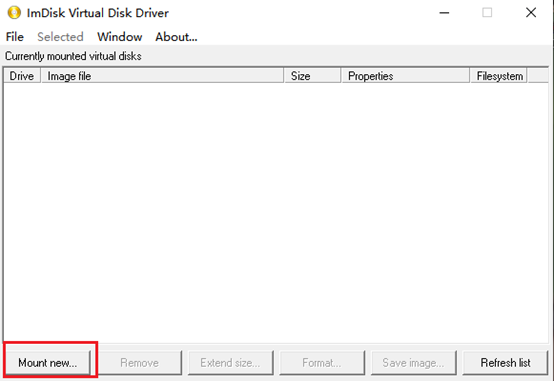{width="2.7083333333333335in"   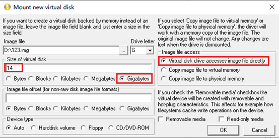{width="2.7083333333333335in"
  height="1.8541666666666667in"}                                   height="1.34375in"}

  ---------------------------------------------------------------- ----------------------------------------------------------------

右图中的参数说明：\
Image file
表示生成的img文件，可以随便放置，当然要找一个剩余空间比较大的位置，比如这里我放在
D:\\123.img。\
后面的 Drive letter
表示要为其分配的盘符，找一个空闲的盘符即可，比如上图中选择的是 G\
下面的Size of virtual disk 单位选择最后一项
Gigabytes，数值要以能放下整个ISO文件内的文件为标准，比如这里设置为
14，表示14GB。\
右侧的 Image file access 必须选择第一项，"Virtual disk drive accesses
image file directly"\
其他选项默认即可。点击OK，创建。\
创建完成后，正常情况下，系统会弹出格式化的提示，如下图所示：

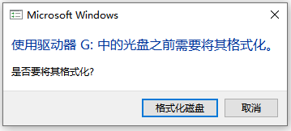{width="3.7395833333333335in"
height="1.6875in"}

点击"格式化磁盘"按钮，将其格式化。（如果没有弹出可以手动在磁盘管理器中格式化）
格式化时注意选择 FAT32，同时卷标必须设置为 **RECOVERY**

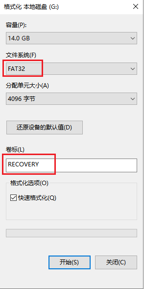{width="3.0625in"
height="6.114583333333333in"}

这个地方可能时间比较久，耐心等待格式化完成，G：盘就可以正常访问了。\
\
**拷贝文件**\
把ISO文件中的所有文件全部拷贝到G:盘中。\
\
**卸载虚拟磁盘**\
等拷贝完毕之后，选择对应虚拟磁盘，点击 Remove 按钮。

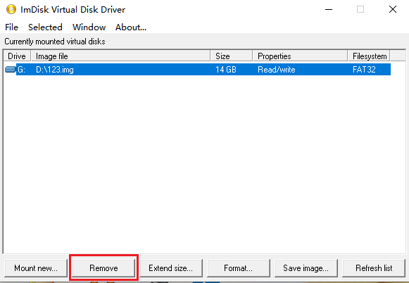{width="5.75in" height="3.96875in"}

至此，镜像文件就制作完成了。

**2.3 重命名、拷贝到Ventoy盘**

将上面2步制作的可启动ISO文件和IMG文件重命名。为了处理方便，这里有几点强制性的要求：\
ISO文件可以随便命名，比如你可以叫 5R31J69690_boot.iso 等。
但是IMG文件必须和ISO文件同名，同时后缀必须改为 VTLRI，比如：

5R31J69690_boot.iso

5R31J69690_boot.VTLRI

这两个文件必须放在同一个位置（同一个目录或子目录下）。原始的那个
Recovery ISO文件就不需要了，整体空间并没有多占多少。

最后，重启电脑，启动到Ventoy, 选择ISO文件启动即可。

**Ventoy内部原理**

**Ventoy MBR格式U盘分区布局**

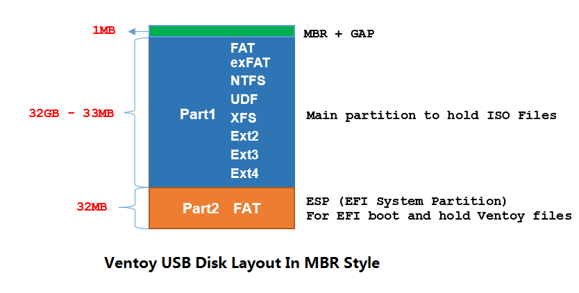{width="5.75in" height="2.90625in"}

上面是一个安装了Ventoy的32GB
U盘的分区示意图。你可以看到，整个U盘被分成了2个分区（MBR格式）。

**为什么选择MBR格式**

为了能支持Legacy BIOS模式，只能选择MBR分区格式

**关于分区1**

Ventoy
将U盘的第一个分区默认格式化为exFAT文件系统来存放ISO文件。exFAT文件系统有比较好的跨平台特性而且也比较适合U盘。\
**从 Ventoy-1.0.11
版本开始，你也可以自己手动再把第一个分区重新格式化为其他文件系统。当前支持的文件系统有:
exFAT/FAT32/NTFS/UDF/XFS/Ext2/Ext3/Ext4**\
需要说明的是，如果选择 XFS/Ext2/Ext3/Ext4
文件系统，则U盘正常是无法在Windows上使用的，也无法用来安装Windows系统，这个比较适合纯Linux的场景。

**关于分区2**

首先，在UEFI模式下必须要有一个EFI系统分区才可以启动，而且这个分区必须是FAT格式的文件系统。这个是UEFI规范的强制性要求，必须遵守。
所以第二个分区就是这个EFI系统分区，用来保存UEFI模式下的启动文件以及Ventoy的其他文件。这些文件都比较小，所以这个分区只分配了32MB的空间就够了。
其实，这个EFI系统分区可以是第一个分区，也可以是第二个分区。这里把它放在第二个分区，纯粹是因为在某些早期版本的Windows系统中，只有U盘的第一个分区才能挂载使用，
后面的分区是看不到的。当然，第二个分区不可见对于Ventoy来说也是件好事，可以防止用户误操作。

这个分区很小，是用来保存Ventoy的核心文件的，所以用户最好不要对其做改动。

**关于1MB的间隙**

这部分空间是用来存放Legacy BIOS模式下的启动文件的

**保留空间**

从 1.0.14
版本开始，Ventoy支持在安装时在磁盘最后保留一部分空间。下图为一个安装了Ventoy的32GB
U盘的分区示意图（2GB的保留空间）。

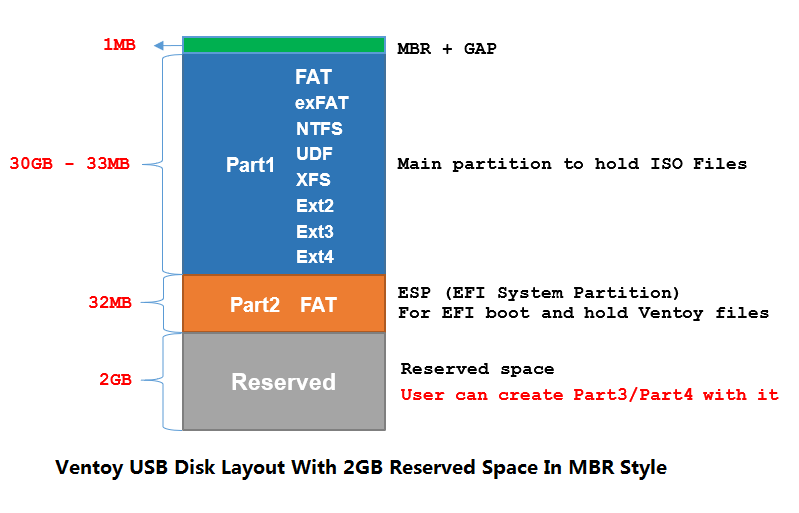{width="5.75in" height="3.6875in"}

在安装时可以在 "选项配置" \-\--\> "分区设置" 中设置要保留的空间大小
(Linux版本是 -r 选项)。注意保留空间只在安装时有效，升级时不关注此项。

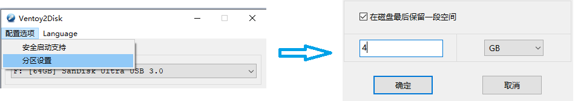{width="5.75in"
height="1.0104166666666667in"}

**保留空间只能位于磁盘的最后面，不能是前面或中间位置**

**分区1和分区2是Ventoy创建的两个分区，这两个分区不能动，不能修改他们的位置或大小**

**可以使用保留空间创建分区3和分区4，这两个分区可以自由使用，不影响Ventoy功能**

**Ventoy GPT格式U盘分区布局**

从 Ventoy-1.0.15 版本开始，在安装Ventoy时可以选择 GPT 分区格式 (Windows:
选项设置\-\--\>分区格式, Linux: -g 选项)\
下面是一个安装了Ventoy的32GB
U盘的分区示意图。你可以看到，整个U盘被分成了2个分区（GPT格式）。

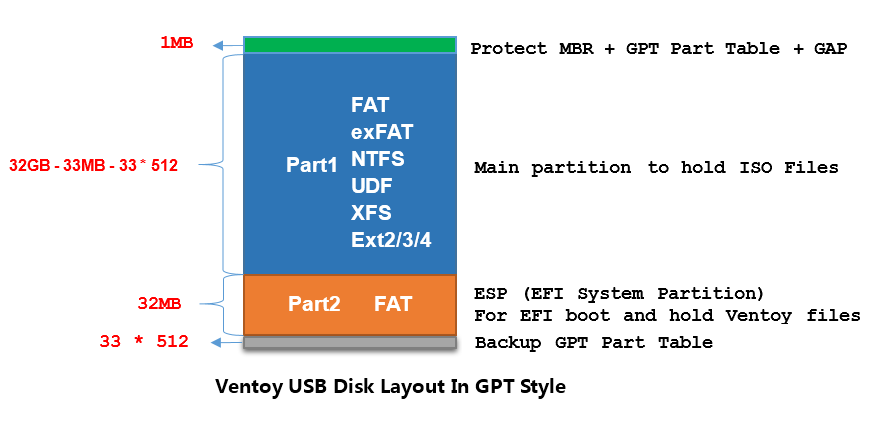{width="5.75in"
height="2.7395833333333335in"}

**关于分区1**

Ventoy
将U盘的第一个分区默认格式化为exFAT文件系统来存放ISO文件。exFAT文件系统有比较好的跨平台特性而且也比较适合U盘。\
**你也可以自己手动再把第一个分区重新格式化为其他文件系统。当前支持的文件系统有:
exFAT/FAT32/NTFS/UDF/XFS/Ext2/Ext3/Ext4**\
需要说明的是，如果选择 XFS/Ext2/Ext3/Ext4
文件系统，则U盘正常是无法在Windows上使用的，也无法用来安装Windows系统，这个比较适合纯Linux的场景。

**关于分区2**

首先，在UEFI模式下必须要有一个EFI系统分区才可以启动，而且这个分区必须是FAT格式的文件系统。这个是UEFI规范的强制性要求，必须遵守。
所以第二个分区就是这个EFI系统分区，用来保存UEFI模式下的启动文件以及Ventoy的其他文件。这些文件都比较小，所以这个分区只分配了32MB的空间就够了。
其实，这个EFI系统分区可以是第一个分区，也可以是第二个分区。这里把它放在第二个分区，纯粹是因为在某些早期版本的Windows系统中，只有U盘的第一个分区才能挂载使用，
后面的分区是看不到的。当然，第二个分区不可见对于Ventoy来说也是件好事，可以防止用户误操作。

这个分区很小，是用来保存Ventoy的核心文件的，所以用户最好不要对其做改动。

**关于开始的1MB空间**

根据GPT格式规范，第一个扇区(LBA0)是一个 Protect MBR, LBA1 \~ LBA33
是GPT分区表信息。LBA34 \~ LBA2047用来保存Ventoy Legacy
BIOS模式的启动文件 (和MBR格式保持一致)

**保留空间**

Ventoy支持在安装时在磁盘最后保留一部分空间。下图为一个安装了Ventoy的32GB
U盘的分区示意图（2GB的保留空间）。

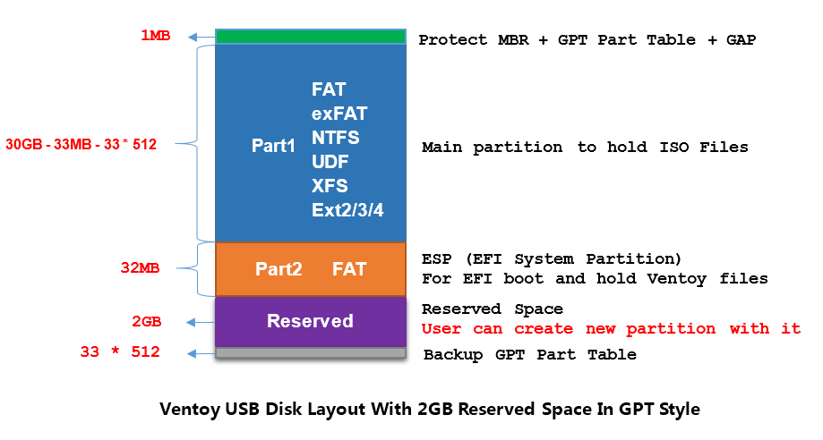{width="5.75in"
height="3.0729166666666665in"}

在安装时可以在 "选项配置" \-\--\> "分区设置" 中设置要保留的空间大小
(Linux版本是 -r 选项)。注意保留空间只在安装时有效，升级时不关注此项。

{width="5.75in"
height="1.0104166666666667in"}

**保留空间只能位于磁盘的最后面，不能是前面或中间位置**

**分区1和分区2是Ventoy创建的两个分区，这两个分区不能动，不能修改他们的位置或大小**

**可以使用保留空间创建分区3、分区4、分区5 \...\...
这些分区可以自由使用，不影响Ventoy功能**

**Ventoy MBR & GPT 格式对比**

**Ventoy MBR vs GPT**

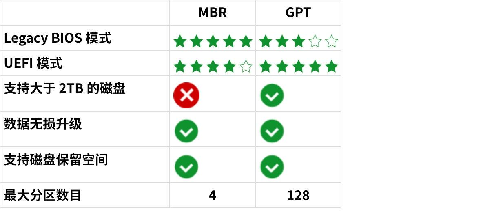

**点击图片可查看完整电子表格**

**Ventoy的功能在 MBR 和 GPT 之间有区别吗？**

没有。不管MBR还是GPT，Ventoy提供的功能都是一致的。

**MBR分区格式支持Legacy BIOS 和 UEFI 模式吗 ?**

支持。但是有一些机器的UEFI固件只识别GPT格式的分区，这种情况下MBR分区格式就不支持了。

**GPT分区格式支持Legacy BIOS 和 UEFI 模式吗 ?**

支持。GPT分区格式是UEFI规范的一部分。因此GPT天然支持UEFI模式，而且没有兼容性问题。\
但是对于Legacy BIOS
模式，在有些机器上可能会有兼容性问题，这也是为什么这里给了3颗星，可以参考这里的
[说明](https://www.rodsbooks.com/gdisk/bios.html)\
具体来说，GPT分区虽然也有一个 Protect MBR,
但是不能设置分区的active标记，另外，0xEE的分区类型有时候也不被一些BIOS接受。

**MBR 或者 UEFI 到底应该选择哪种格式呢？**

我个人建议如果没有特殊需求，优先使用MBR分区格式。
**当然，适合自己的才是最好的。**

**Legacy BIOS 访问范围限制**

**背景介绍**

某些主板上的BIOS，在Legacy模式下有访问范围的限制。比如，有些在Legacy
BIOS模式下只能访问磁盘前面137GB的数据，超出这个范围就无法访问。
你可以网上搜索 \"Legacy BIOS 137GB\" 能搜到不少相关的文章。

这是BIOS的固有缺陷，任何软件都无法解决，除非你升级主板里的BIOS。另外，这个限制的值在不同机器上也是不一样的，只是
137GB 这个值比较常见，但也确实有一些机器的BIOS上，
这个值更小，比如在有一些惠普的服务器上 (DL380 Gen8)，这个值是 8GB，超过
8GB 的范围就不能访问。

因此如果你的电脑主板BIOS也有这个问题，而你又把Ventoy安装在一个容量较大（比如
256GB）的U盘上时，启动就会有问题。

**典型现象**

只在Legacy BIOS模式出问题，UEFI OK

同样的操作，使用小容量的U盘（比如
8GB/16GB）就OK，大容量U盘（比如256GB）就有问题

出问题时不显示Ventoy启动菜单，直接进入grub命令行

**为什么使用其他工具没问题（比如 Rufus）**

当你使用其他工具（比如
Rufus）创建可启动U盘时，U盘会被重新格式化，ISO文件内的数据一般会按照从前到后的顺序依次写入U盘。

一般很少有ISO文件会超过
8GB，因此，正常写入的数据都不会超出BIOS的访问范围（比如
137GB），因此普通使用时一般不会触发这个问题。

但是Ventoy启动相关的文件保存在第2个分区，而第2个分区位于U盘最后面，所以，Ventoy启动时一上来就要访问U盘最后面的位置，所以一上来就会出问题。

**规避方案1 （推荐）**

Ventoy支持安装时在磁盘的后面保留一部分空间。可以利用这个功能，在安装时，保留一大部分空间，使得Ventoy的分区1和分区2不超过BIOS的访问限制范围即可。\
比如，对于 256GB 的U盘，如果BIOS的最大访问范围为 137GB，在安装时保留
150GB空间，则Ventoy前2个分区就只会位于前面
106GB的范围，就不会触发BIOS的这个限制了。\
关于保留空间的配置，请参考
[说明](https://www.ventoy.net/cn/doc_disk_layout.html#reserve_space)

**规避方案2**

**重新手动格式化第1个分区 (NTFS/exFAT \...)**

这是为了确保下面第2步中的文件保存在BIOS可访问范围之内

**拷贝 ventoy.disk.img.xz 文件到第1个分区的 ventoy目录下**

ventoy.disk.img.xz文件位于Ventoy的安装包内（ventoy目录下）。把这个文件拷贝到第1个分区的ventoy目录下（需要手动创建此目录）。

**说明**

规避方案2
的原理也很简单，就是如果第2个分区读不到就从第1个分区的上面这个文件中读取。\
需要说明的是，这只是一个规避方案。一般情况下，U盘里的文件不多，文件都不会超出BIOS的访问范围，就不会出问题。\
而一旦你在U盘中放了非常多的ISO文件，就有可能有些文件会超出BIOS的可访问范围。这些ISO文件在启动时一定会出问题，因为BIOS无法读取他们。\
\
**额外的好处**\
只针对Legacy模式来说，方案2
虽然是用来规避BIOS的缺陷的，不过也可以用来规避第二个分区的数据被破坏的情况。因为流程上都是访问Ventoy的相关文件失败时就转而从
上面提到的那个文件中获取。而访问失败有可能是BIOS的限制，也有可能是文件被破坏了。

**PE简介**

+-----------------------------------------------------------------------+
| **Windows预先安装环境**（英语：Microsoft Windows Preinstallation      |
| Environment，简称 Windows PE 或 WinPE），是[Microsoft                 |
| Windows](https://zh.wikipedia.org/wiki/Microsoft                      |
| _Windows)的轻量版本，主要提供[个人电脑](https://zh.wikipedia.org/wiki |
| /%E5%80%8B%E4%BA%BA%E9%9B%BB%E8%85%A6)开发商（主要为[OEM](https://zh. |
| wikipedia.org/wiki/%E4%BB%A3%E5%B7%A5%E7%94%9F%E4%BA%A7)厂商）、[工作 |
| 站](https://zh.wikipedia.org/wiki/%E5%B7%A5%E4%BD%9C%E7%AB%99)、[服务 |
| 器](https://zh.wikipedia.org/wiki/%E4%BC%BA%E6%9C%8D%E5%99%A8)打造定  |
| 制的[操作系统](https://zh.wikipedia.org/wiki/%E4%BD%9C%E6%A5%AD%E7%B3 |
| %BB%E7%B5%B1)环境，或系统离线时进行[故障排除](https://zh.wikipedia.or |
| g/wiki/%E6%8E%92%E9%94%99)来使用，以取代格式较旧的[MS-DOS](https://zh |
| .wikipedia.org/wiki/MS-DOS)[启动磁片／启动光盘](https://zh.wikipedia. |
| org/w/index.php?title=%E5%95%9F%E5%8B%95%E7%A3%81%E7%89%87%EF%BC%8F%E |
| 5%95%9F%E5%8B%95%E5%85%89%E7%A2%9F&action=edit&redlink=1)。其可理解为 |
| Windows的[Live                                                        |
| CD](https://zh.wikipedia.org/wiki/Live_CD)或[子系统](https            |
| ://zh.wikipedia.org/wiki/%E5%AD%90%E7%B3%BB%E7%BB%9F)，系统核心采用32 |
| 比特/64位。由于[硬件需求](https://zh.wikipedia.org/wi                 |
| ki/%E7%B3%BB%E7%B5%B1%E9%9C%80%E6%B1%82)不大，因此便于存储在[光盘](ht |
| tps://zh.wikipedia.org/wiki/%E5%85%89%E7%A2%9F)、[U盘](https://zh.wik |
| ipedia.org/wiki/%E9%9A%A8%E8%BA%AB%E7%A2%9F)等各种便携式[存储设备](ht |
| tps://zh.wikipedia.org/wiki/%E5%84%B2%E5%AD%98%E8%A3%9D%E7%BD%AE)中。 |
|                                                                       |
| Windows                                                               |
| PE最初是设计给个人电脑开发商使用，以便于电脑生产时将Window            |
| s[预装](https://zh.wikipedia.org/w/index.php?title=%E9%A0%90%E8%A3%9D |
| %E8%BB%9F%E9%AB%94&action=edit&redlink=1)入内，但目前也以[捆包](https |
| ://zh.wikipedia.org/wiki/%E8%BB%9F%E9%AB%94%E9%96%8B%E7%99%BC%E5%A5%9 |
| 7%E4%BB%B6)的方式提供给一般的[软件开发者](https://zh.wikipedia.org/wi |
| ki/%E8%BB%9F%E9%AB%94%E9%96%8B%E7%99%BC%E8%80%85)使用，目前从[Windows |
| XP](https://zh.wikipedia.org/wiki/Windows_XP)以及之后的 Windows       |
| 公开版本都有支持，现在通过[Windows                                    |
| ADK]                                                                  |
| (https://zh.wikipedia.org/wiki/Windows_ADK)（WADK）可以免费广泛使用。 |
+-----------------------------------------------------------------------+

**特点**

+-----------------------------------------------------------------------+
| **WinPE是简化版的Microsoft                                            |
| Windows**，放在一片可直接启动的[CD](https                             |
| ://zh.wikipedia.org/wiki/CD)或[DVD](https://zh.wikipedia.org/wiki/DVD |
| )光盘或者U盘，以加载到存储器的方式执行。特点是启动时出现此版本Windows |
| PE简化自之原版本的启动画面，以及出现简单的图                          |
| 形接口（[GUI](https://zh.wikipedia.org/wiki/GUI)），亦能执行[Internet |
| Explorer](https:/                                                     |
| /zh.wikipedia.org/wiki/Internet_Explorer)。相比完整的Windows，Windows |
| PE功能有限，主要用于系统维护。                                        |
|                                                                       |
| WinPE支持[网络](https://zh.wikipedia.org/wiki/%E7%B6%B2%E8%B7         |
| %AF)，但只附带以下工具：[命令提示符](https://zh.wikipedia.org/wiki/%E |
| 5%91%BD%E4%BB%A4%E6%8F%90%E7%A4%BA%E5%AD%97%E5%85%83)、[记事本](https |
| ://zh.wikipedia.org/wiki/%E8%A8%98%E4%BA%8B%E6%9C%AC)和一些维护工具。 |
|                                                                       |
| WinPE初衷只是方便企业制造自定义的[Microsoft                           |
| Windows](https://zh.wikipedia.                                        |
| org/wiki/Microsoft_Windows)，因此市面上并没有出售（但允许无偿外发）。 |
|                                                                       |
| 在[微软](https://zh.wikipedia.org/wiki/%E5%BE%AE%E8%BB%9F)的批        |
| 准下，其他[软件](https://zh.wikipedia.org/wiki/%E8%BB%9F%E9%AB%94)公  |
| 司可附上自己的软件于WinPE，令启动电脑时候执行有关的程序。这些软件通常 |
| 是系统维护，在电脑不能正常运作的情况下，可运用有关的系统维护软件修复  |
| 电脑。维护软件包括[Symantec](https://zh.wikipedia.org/wiki/Symantec)  |
| [Norton Ghost](https://zh.wikipedia.org/wiki/Norton_Ghost)等等。      |
|                                                                       |
| **基于Windows NT 6.0之后的Windows，包含但不限于[Windows               |
| Vista](https://zh.wikipedia.org/wiki/Windows_Vista)、[Windows         |
| 7](https://zh.wikipedia.org/wiki/Windows_7)、[Windows                 |
| 8](https://zh.wikipedia.org/wiki/Windows_8)、[Windows                 |
| 10](https://zh.wikipedia.org/wiki/Windows_10)和[Windows               |
| 11](https://zh.wikipedia.org/wiki/Windows_11)的安装程序，亦           |
| 是基于WinPE上执行。从Vista之后，Windows的安装方式基本一致。且在"安装  |
| Windows"界面上按下Shift+F10，可开启"命令提示符"。**                   |
|                                                                       |
| WinPE大多被[OEM](https://zh.wikipedia.org/wiki/OEM                    |
| )厂商所使用，举例来说就像刚买回来的品牌套装电脑，不需要完全从头安装操 |
| 作系统，而是从完成安装开始。OEM厂商可以自定系统安装完成后，执行安装驱 |
| 动程序的动作、修改'电脑'中的OEM商标、安装辅助程序。简单来说WinPE的作  |
| 用是使用在大量的电脑安装（同规格之电脑），以达到快速且一致性的安装。  |
|                                                                       |
| 因为和电脑中的系统没有关联，可以任意添加、修改或复制系统文件，甚至    |
| 可以格式化电脑中系统所在的磁盘，这种优势使得PE可以深入操作系统文件。  |
+-----------------------------------------------------------------------+

**版本**

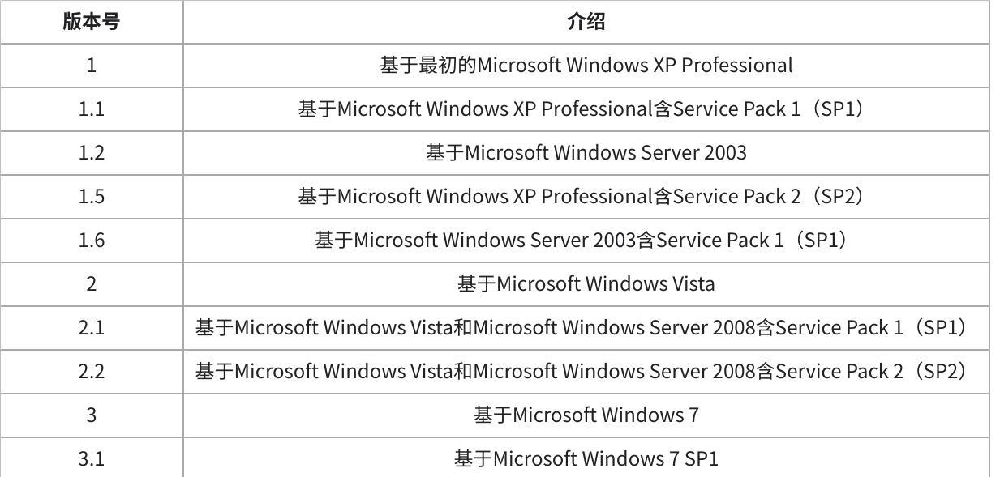

**点击图片可查看完整电子表格**
