**SSD加速HDD**

本文将操作硬盘，数据有丢失风险，请辨析内容谨慎操作，本文将不会承担任何数据损毁的责任

**概述**

SSD/Nvme
硬盘价格在今年（2024）飞速上涨，过惯了低价固态的人们根本无法接受如此高昂的价格

于是你也许跟我一样重新捡起了多年未见的机械硬盘------准确的说，自从上大学以来几乎没有再在系统内安装机械硬盘

众所周知的（你不知道就算了），机械硬盘有不少缺点

寻道访问速度慢 ： 读写都很慢捏

不抗揍

磁头在寻道访问数据时高速运转，如果此时遇到磕碰将是灾难性的------划伤盘片造成数据丢失

在掉电时若磁头没有及时归位（大部分情况下都会自动归位，即使蓝屏或是拉闸）------数据丢失

体积大，质量大 ： 不便于携带，很占用空间，运输时需要额外防护

但是也有优点

价格低廉 ：
二手的服务器拆机盘（服役大概5年，机械硬盘的设计稳定使用周期大概是20\~30年）价格非常便宜

容量更大

得益于盘片的奇妙设计，机械可以轻易做到很大的容量，2T 4T 8T 12T
比比皆是，而固态往往只有2T的最大容量

数据恢复简单

HDD通过盘片的磁性变化存储数据，如果你的硬盘主控（SSD也有主控）损毁或者别的原因导致磁盘无法正常访问，那么可以通过拆开外壳直接读取磁性信息来恢复数据（尽管价格高昂）

通过软件扫描恢复数据可能性也比SSD高（因为数据没有被立即覆盖）

那么，假设你真的心动了，想要购买一块机械硬盘来存放你的*小电影*或者非常重要的*学习资料*
或是论文什么的，可以参考下文

**机械硬盘选购**

**LMR,PMR,CMR,SMR?**

机械硬盘原理请参见参考资料，此处从简。

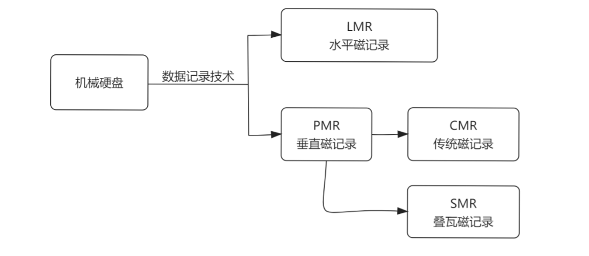{width="5.75in" height="2.5in"}

总的来说，购买存储资料的硬盘务必购买标记为CMR的硬盘，只标注PMR硬盘的卖家大概在耍心眼

简记：

要当聪明人（CMR）

不要做失马人（SMR）

**转速&缓存&容量**

常见的转速为 5400 和 7200 转，2.5吋的HDD大多只有
5400转，大容量机械硬盘就没必要纠结高转速对噪声的影响，转速越高越好

机械硬盘还会有缓存标注，越大越好

容量的选择需要谨慎，存储容量越大，炒豆子声音越大，如果你不知道买什么大小的合适，建议从4TB
开始

**安装方式**

所有的主板目前都支持SATA协议及其接口（笔记本会使用一些转接器）

你首先需要检查：

你的电源是否有供电接口（一个扁状的，小12pin）

如果你没有或者因为全模组线材等原因找不到了，需要重新购买或使用大4pin转换器转换

一个SATA数据线

因为一根一根的数据线乱窜太麻烦了，因此你可以购买多合一的SATA数据线，例如安费诺

2\~4颗硬盘固定螺丝

硬盘架（如有必要）

螺丝和数据线可以请求商家一同附赠，否则为了一块硬盘买几颗螺丝有的你受的

下图是硬盘线材及其接法，别担心，有防呆口

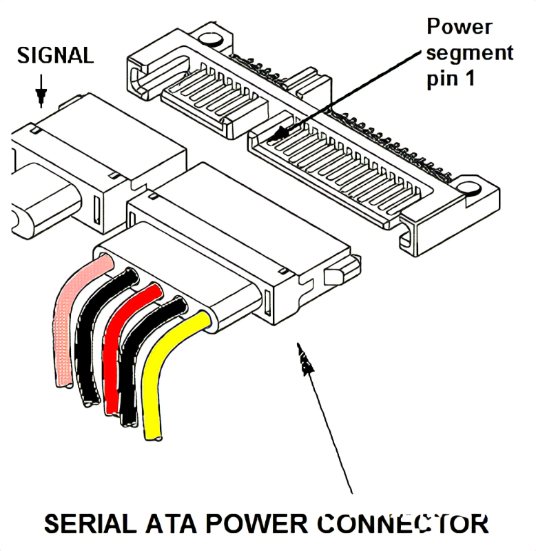{width="4.395833333333333in"
height="4.520833333333333in"}

**加速方案**

**RST（Optane）加速**

WARN: Intel系列已经宣布Optane系列停产

傲腾加速是非常老牌的加速方案，如果你的CPU是Intel的（
i系列），可以考虑使用傲腾加速

具体的技术是 [Intel
RST（英特尔快速存储技术）](https://www.intel.cn/content/www/cn/zh/support/products/55005/technologies/intel-rapid-storage-technology-intel-rst.html)

+-----------------------------------------------------------------------+
| 注意：                                                                |
|                                                                       |
| 如果你希望使用这个技                                                  |
| 术，请务必完全阅读该块下的所有内容，你需要完全确认你的机器能够使用他  |
+-----------------------------------------------------------------------+

**M系列**

M系列是非常老旧的系列，加速容量为 16GB 32GB
64GB，一般情况下你能购买到的容量为16GB ，价格非常便宜（20RMB）
，你可以在TB等电商平台轻松淘到

可以作为普通SSD NVME使用，接口为 M&B Key

读取速度比较高，随机读取速度比致钛好一些

写入速度中规中矩，比致钛差

可以配合RST作为加速盘使用

不支持B760等较新的芯片组

如果你不知道是否支持，请给你的主板服务商发邮件询问，客服不一定知道这么深的东西

总的来说，新的主板已经不建议使用这个系列的傲腾，如果支持，可以接着参考H系列的安装教程

这是实物图和测速图

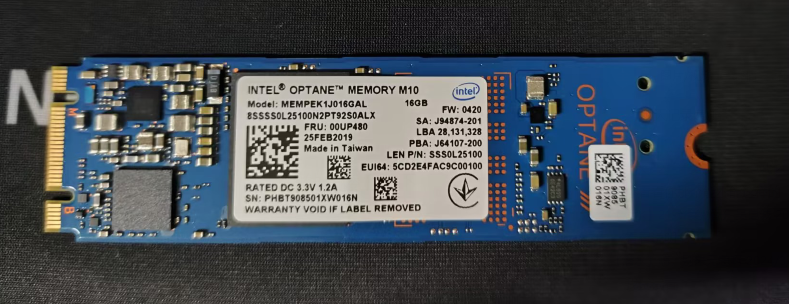{width="4.885416666666667in"
height="1.8854166666666667in"}

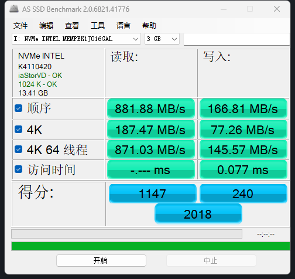{width="4.895833333333333in"
height="4.625in"}

**H系列**

H系列是比较新的傲腾系列，有H10和H20，且全身混合硬盘（如16+256款式）

16GB ： 可以提供傲腾加速的容量

256GB ： 自身携带的容量，可以在里面安装操作系统等，不提供加速

上文提到的 B760 系列主板仅支持H系列混合硬盘的傲腾加速

H系列的加速盘非常昂贵，但似乎比正常的同容量大小的NVME硬盘便宜，很奇怪

**安装**

在将傲腾硬盘正确安装到电脑后，前往 [Optane RST
驱动](https://www.intel.com/content/www/us/en/download/19512/intel-rapid-storage-technology-driver-installation-software-with-intel-optane-memory-10th-and-11th-gen-platforms.html)
下载界面下载傲腾驱动

安装完成后启动

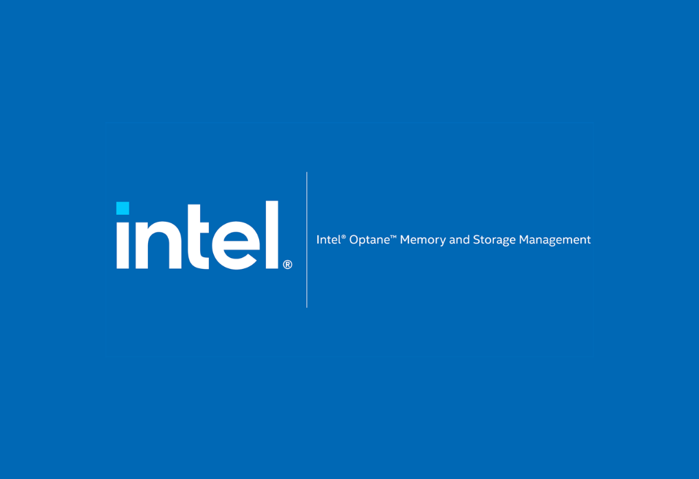{width="3.6666666666666665in"
height="2.5208333333333335in"}

在状态视图你可以看到你的硬盘状态，确认你的傲腾硬盘在这上面

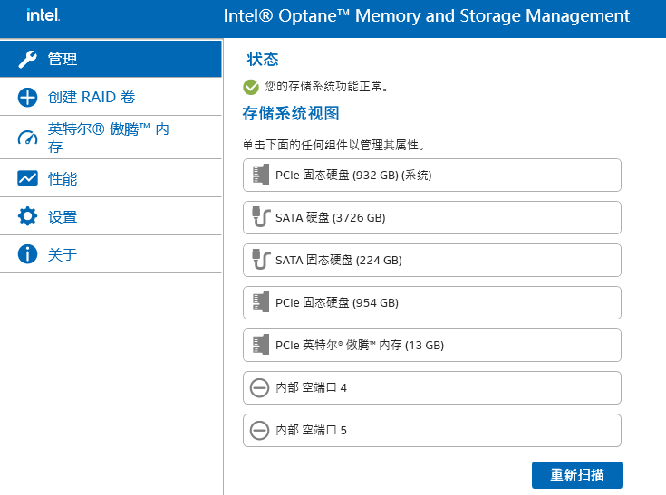{width="5.75in"
height="4.28125in"}

然后来到傲腾内存栏，尝试创建傲腾加速卷（由于我没有购买，演示到此结束）

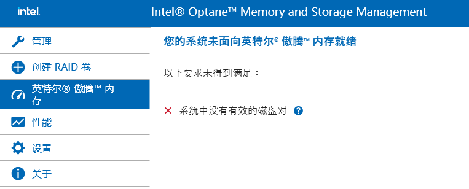{width="5.75in"
height="2.3125in"}

如果你愿意续写这段教程，欢迎联系我们!

**StoreMI AMD**

这是AMD平台自己研发的SSD加速HDD方案，类似于上文提到的Intel
RST，但是我也没有对应的AMD平台供测试，也许可以参考这个
[文章](https://post.smzdm.com/p/ax0reqdw/)

如果你愿意续写这段教程，欢迎联系我们!

**软加速**

**Primocache (windows)**

一个通过windows内核劫持文件请求进行软件处理将请求指向缓存区从而达到加速目的

如果没有命中缓存，则会去硬盘检索所需文件，很基本的cache实现原理

注意：直接劫持内核IO请求的行为理论上会导致系统不稳定，尤其在你的系统本身环境复杂时，你需要自行衡量安全性

**软件下载/授权**

你可以通过
[这个链接](https://static.romexsoftware.com/download/primo-cache/PrimoCache_Mui_Setup_4.3.0.exe)
直接下载官方正版（点击即下载）

截止写文时，最新版本是 4.3.0

注意：我们与该软件没有任何关系，你的所有购买行为均系个人意愿作出

这是
[软件介绍页](https://www.romexsoftware.com/zh-cn/primo-cache/index.html)
，这是
[授权购买页](https://www.romexsoftware.com/zh-cn/primo-cache/purchase.html)

**设置缓存任务**

点击第一个绿绿的加号，进入新增任务界面

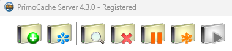{width="3.9479166666666665in"
height="0.875in"}

在这里，你可以为一整个硬盘（无论是SSD还是HDD）设置缓存加速任务，也可以单独为一个磁盘分区设置缓存加速任务（对于一些特殊分区你可能需要进行颗粒度细一些的额外设置）

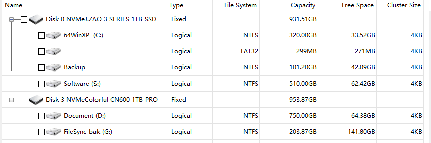{width="5.75in"
height="1.90625in"}

而后将进入细节设置界面

**Tips**

缓存盘大小最好是被加速盘大小的20%以上

对于大容量机械硬盘往往难以达到这个要求（4TB的HDD需要819.2GB的SSD）

可以使用SSD SATA加速机械（会比M.2 NVMe便宜不少）

**L1缓存设置**

L1 Cache
是内存缓存，相当于（一小部分）内存当做硬盘使用，通过特定算法将访问频繁的文件暂存在内存里，下次再被访问时直接从内存取出而不是前往硬盘，极大加快读取速度！

他会默认给你设置一个内存大小

务必根据自己电脑工作时能够剩余的内存大小结合你的需要进行设置

因为他会直接占用你设置的内存，如果你机器的内存本身不大，那么设置为1024MB
/ 2048MB 即可

**L2缓存设置**

L2 Cache
是使用一块磁盘充当缓存盘，这块磁盘通常是访问速度更快的硬盘，例如

使用SSD加速HDD的读写速度

使用M2 NVMe SSD加速普通SSD（罕见）

在设置之前，你需要点击小图标进入管理界面，添加一个可以用于缓存加速的硬盘（整块硬盘）

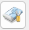{width="0.3333333333333333in"
height="0.3541666666666667in"}

点击Create Level-2 Storage
进入二级缓存创建页面，选择用于加速的硬盘（务必使用整块硬盘加速）

注意：这块硬盘的数据将被清除且无法另作他用

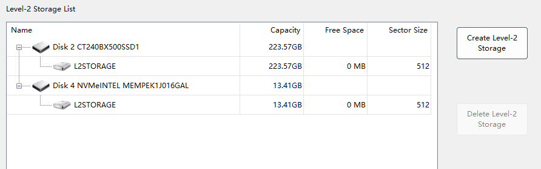{width="5.75in"
height="1.8020833333333333in"}

添加成功后会自动初始化，你可以在列表中看到，然后返回上一页进行缓存大小的设置

注意：如果这个时候你发现无法设置，可以先完成任务添加，而后重新进入管理界面（双击任务）即可

使用下拉框添加一块加速盘（你可以设置加速的大小）

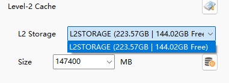{width="3.96875in"
height="1.4479166666666667in"}

因为二级缓存使用一整个SSD进行加速，空间比较大，可以按需设置大一些

**R/W & Shared**

除了对一级、二级缓存的大小进行设置，还可以分别设置每个缓存的读缓存 和
写缓存 的大小

他们默认是shared ：自动调整读写缓存

对于一些读多写少 或写多读少的硬盘推荐进行分别设置，以便调优

对于IO访问频繁 的硬盘，推荐进行设置

否则可能出现写入内容在缓存堆积覆盖读取缓存的情况

对于一些特殊的应用场景，例如你完全不希望内存进行写缓存，直接使用二级缓存进行写缓存，可以直接将内存的写缓存设置为0

**监视面板**

这里简单的介绍一下监视面板，你点击任何一个任务可以看到任务的总的面板，点击任何一个任务下的磁盘可以看到**当前磁盘的面板**

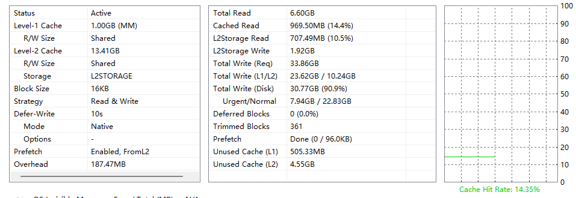{width="5.75in"
height="1.9791666666666667in"}

可见，监视面板分为左中右三个部分

左侧面板：配置面板，这是你对当前任务/磁盘设置的配置、延迟写入配置/写入模式、预计占用、预取设置等

一级缓存大小（1GB）、缓存的读写方式（shared），缓存块大小（16KB）

中间面板：实时面板，这是当前任务/磁盘配置的当前状态

缓存读取数量（969.50MB
）、缓存读取命中率（14.4%），二级缓存读写数量、总写入请求、一二级缓存写入请求、预取状态（已完成(Done)
）、预取数据大小（96KB ）

未使用的一二级缓存

应急写入和普通写入数量

右侧面板：缓存命中的统计线

经常关注统计面板，可以尝试调优以及监视当前工作状态是否正常

**Prefetch(预取)**

软件会根据算法统计到的数据使用情况，将一些缓存智能的预先加载入内存（windows启动时，如果设置），这样能在一开始就提高缓存命中率（机械硬盘预热非常久）

他不总是有效，你需要调优，有一个锁定当前预取缓存按钮，当你调优完成时可以尝试锁定

但你也应当注意随着windows的使用热数据 可能会发生变化

**DeferWrite(缓写)**

软件会拦截程序的写入，将写入数据先暂存在缓存里，在写入周期到后将数据写入硬盘中（时间越长，数据在缓存内待的时间越久），这可以大大减少硬盘的写入压力

注意：

缓写会导致数据无法即时写入硬盘，这可能引发脏数据、幻数据问题

建议用在写多读少的硬盘上

减少回写时间以减少脏数据发生的可能性

由于数据索引存储在内存，如果遇到电脑断电/蓝屏等异常，数据将无法再重启后重新写入，数据直接丢失

即使二级缓存上，因为索引丢失，也无法重新写入硬盘

对数据安全性有要求的请关闭缓写功能

**HitRate(缓存命中率)**

这个指标评价了你的SSD对于加速HDD贡献了多少

如果缓存命中率高（一般认为 \>95%
），那么你的SSD很好的加速了HDD，如果过低，你可能需要调整你的缓存设置，如增加缓存大小等

注意：

初次使用时，软件算法需要学习哪些数据是热数据，因此一开始的命中率不会很高

在一段时间的使用、记录后缓存命中率会逐步上升

写多读少的硬盘缓存命中率上升速度较慢

**UrgentWrite(紧急写入)**

这个指标非常重要，如果你设置了缓写，他将反应你的磁盘是否处在一种危险的状态

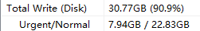{width="2.6145833333333335in"
height="0.4166666666666667in"}

在这个示例中，总写入数据是30.77GB
，因为开启了缓写，数据将先进入缓存盘，然后逐步写入硬盘

Normal ：普通写入，即正常的数据通过缓存盘，然后非常普通的再被写入硬盘

Urgent ：紧急写入，发生了一些事情，导致数据直接被写入了硬盘

这大部分情况下都是因为缓存盘容量不够大，写入请求过多，无法缓存所有写入，因此有部分数据被直接写入了硬盘

你应该尽可能避免这种情况发生！

**Q&A**

**开启缓写技术会导致我的数据在掉电/蓝屏/系统故障时丢失吗？**

是的

**我的授权可以转移吗？如何转移？**

如果你使用在线激活的方式，可以每个月申请3次授权转移，但每一次只能给一台电脑使用

如果使用离线/文件激活，那么将绑定主板，无法转移

重装系统不会导致授权丢失

**我如何提升我的缓存命中率**

提高缓存盘大小

**附件**

**名词解释**

HDD ： 机械硬盘，常见为3.5英寸（台式机）或2.5英寸（笔记本）

SSD ： 固态硬盘，常见为2.5英寸，也可以是长条状

NVME ： 使用NVME协议的固态硬盘，常见为长条状

**参考资料**

如果你发现有的参考资料不是超链接，那很正常

[机械硬盘磁道区分](https://zhuanlan.zhihu.com/p/635907853?utm_id=0)

机械硬盘实现原理

硬盘接口（IDE SATA SAS U2 SCSI）
