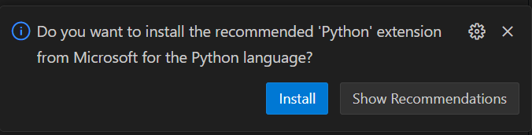

**VSCode及环境配置**

本文暂时仅介绍Windows平台下的安装配置

**VSCode安装**

点击[code.visualstudio.com](https://code.visualstudio.com/docs/?dv=win64user)下载安装包

启动安装程序，一路下一步，直到如图所示，建议全部勾选

{width="4.927083333333333in"
height="3.7083333333333335in"}

**(可选)**安装**中文**语言包：按Ctrl+Shift+X，输入\"Chinese\"，点Install

{width="5.75in" height="3.4375in"}

**环境配置**

注：此部分建议自备**魔法**，如果机主没有，可以用手机临时给他共享个，此教程请看附录

**Python**

上官网[www.python.org](https://www.python.org/)下载安装包

点击Install Now

打开vsc，随便找个地方新建个.py文件，如\"hello.py\"文件，打开，**右下角**会弹出一个弹窗，点击Install

{width="4.75in" height="1.21875in"}

**(可选)**安装vsc的**jupyter notebook**支持：

打开vsc，随便找个地方新建个.ipynb文件，如\"hello.ipynb\"

输入**print(114514)**，按Ctrl+Alt+Enter运行

**上方**会弹出一个弹窗，选择Install，并一路点Install

{width="5.645833333333333in"
height="1.5in"}

{width="5.75in"
height="1.5208333333333333in"}

**C/C++**

如果有魔法，则采用Scoop安装，会方便很多，否则需要手动下载MinGw64。下面介绍两种情况的配置。

**有魔法**的情况下，基于Scoop来安装环境

安装Scoop，这是其官网：https://scoop.sh/

具体来说，就是复制官网首页的两行代码到Powershell中执行

  -----------------------------------------------------------------------
  PowerShell\
  **Set-ExecutionPolicy** -ExecutionPolicy RemoteSigned -Scope
  CurrentUser\
  **Invoke-RestMethod** -Uri https://get.scoop.sh \|
  **Invoke-Expression**

  -----------------------------------------------------------------------

安装好后，再执行这两行命令，用于安装git和更新scoop软件索引

  -----------------------------------------------------------------------
  PowerShell\
  scoop install git\
  scoop update

  -----------------------------------------------------------------------

安装C/C++编译环境、gdb调试器

  -----------------------------------------------------------------------
  PowerShell\
  scoop install gcc gdb

  -----------------------------------------------------------------------

重新打开vsc，随便找个地方新建个.c或.cpp文件，如\"hello.cpp\"，打开，**右下角**会弹出一个弹窗，点击Install

{width="4.677083333333333in"
height="1.09375in"}

大功告成，点击**右上角**的**▷**按钮**运行**即可，可以在▷右边的下拉列表里选择**运行**或**调试**

注意：**源文件**的**名称不能包含中文**，**源文件**所在的**完整路径名称**中也**不能出现中文**，否则用vsc官方的C++插件编译运行会报错。

如果机主需要中文路径，则需要额外安装【Code Runner】插件

如果没有**魔法**，教程后两个步骤不需要变动。前两个步骤则需要手动下载gcc编译器。

注：我知道网上的教程都要你写什么【tasks.json】和【launch.json】，因为我一开始也是看的这些教程。但老实说，我没搞懂，而且每新建一个项目都要写这玩意，太麻烦了。所以我摸索出了这种免配置的方法，原理就是vsc的C++插件会自动扫描PATH路径下的编译器，自动生成那两个json文件。

至于为什么每个编程语言的vsc配置，我都用随便新建一个hello文件的方式呢。一方面，这确实会触发vsc的recommand弹窗，这样你只要记得那门语言的源文件后缀名就行了，而不需要知道具体的vsc插件是什么；另一方面，新建一个hello文件输出hello
world，也是检验配置是否成功的方式。属于是一举两得了。

**Java**

待补充\.....（因为我也不用）（而且大多数都用JetBrain的**IntelliJ
IDEA**了）

**NodeJs**

可以采用上文提到的Scoop一键安装NodeJs：scoop install
nodejs，也可以到官网https://nodejs.org/下载安装包

**推荐的vsc插件**

1\. **CodeSnap**

{width="5.75in"
height="4.041666666666667in"}

生成漂亮的代码截图

2\. **Live Server**

快捷、轻量、热重载的Server，用于预览静态网站

3\. **WakaTime**

记录VSCode使用情况（时长、编程语言占比、项目开发占比）

4\. **VS Code Counter**

代码量统计

5\. **VSC Netease Music**

在vsc里听歌
