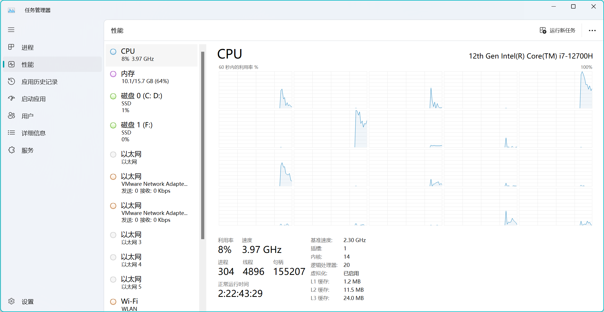
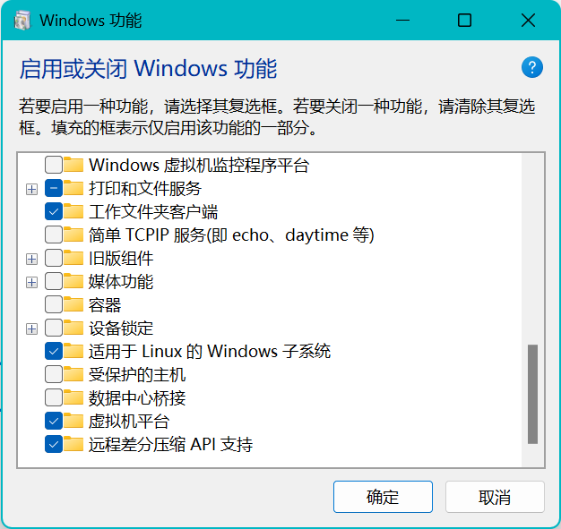

**WSL的安装和使用**

参考文献:

<https://docs.eesast.com/docs/tools/wsl>

https://zhuanlan.zhihu.com/p/536686989

https://zhuanlan.zhihu.com/p/224753478

**WSL简介**

WSL（Windows Subsyetem for Linux，适用于 Windows 的 Linux 子系统），是
Microsoft 公司于 2016 年在 Windows 10
平台发布的一项功能，其使得用户可以在 Windows 操作系统上运行 ELF 格式的
Linux 可执行文件。

WSL 目前已发布两代产品：WSL 1 和 WSL 2。WSL 1 实现了 Linux 兼容层，将
Linux 系统调用转换为 Windows NT 系统调用；而 WSL 2 则利用 Windows 的
Hyper-V 功能，通过虚拟化技术直接运行 Linux 虚拟机，更接近原生 Linux
操作系统体验。

**WSL 1**

适用于 Linux 的 Windows 子系统可让开发人员按原样运行 GNU/Linux 环境 -
包括大多数命令行工具、实用工具和应用程序 -
且不会产生传统虚拟机或双启动设置开销。

+-----------------------------------------------------------------------+
| 您可以： *在 Microsoft Store 中选择你偏好的 GNU/Linux 分发版。*       |
| 运行常用的命令行软件工具（例如 grep、sed、awk）或其他 ELF-64          |
| 二进制文件。 运行 Bash shell 脚本和 GNU/Linux 命令行应用程序，包括：  |
|                                                                       |
| 工具：vim、emacs、tmux                                                |
|                                                                       |
| 语言：NodeJS、Javascript、Python、Ruby、C/ C++、C# 与 F#、Rust、Go    |
| 等。                                                                  |
|                                                                       |
| 服务：SSHD、MySQL、Apache、lighttpd、MongoDB、PostgreSQL。 使用自己的 |
| GNU/Linux 分发包管理器安装其他软件。 *使用类似于 Unix 的命令行 shell  |
| 调用 Windows 应用程序。* 在 Windows 上调用 GNU/Linux 应用程序。       |
+-----------------------------------------------------------------------+

**WSL 2**

WSL 2 是适用于 Linux 的 Windows 子系统体系结构的一个新版本，它支持适用于
Linux 的 Windows 子系统在 Windows 上运行 ELF64 Linux 二进制文件。
它的主要目标是提高文件系统性能，以及添加完全的系统调用兼容性。

这一新的体系结构改变了这些 Linux 二进制文件与Windows
和计算机硬件进行交互的方式，但仍然提供与 WSL
1（当前广泛可用的版本）中相同的用户体验。

单个 Linux 分发版可以在 WSL 1 或 WSL 2 体系结构中运行。
每个分发版可随时升级或降级，并且你可以并行运行 WSL 1 和 WSL 2
分发版(推荐直接使用WSL 2)。 WSL 2
使用全新的体系结构，该体系结构受益于运行真正的 Linux 内核。

简单来说WSL2是WSL的加强版，其实现方式与WSL不同，并且WSL
2拥有完整的Linux内核、更贴近真实Linux的使用场景。

**为什么使用WSL**

  ------------------- -------------------------------- -------------------------------------------------------------
  方式                优点                             缺点

  虚拟机安装运行      最安全的隔离/兼容性              对硬件资源需求高

  双系统安装运行      体验更佳                         成本和稳定性需求高(PC)

  远程服务器运行      最安全的隔离/兼容性              依赖、带宽、需要固定公网IP和高额的运营成本

  直接安装Linux系统   完整使用体验                     适应新环境、硬件兼容性、无法做到无缝集成

  WSL方式             安全性较好、启动迅速、无缝融合   使用体验可能不如完整安装Linux系统、对新型硬件支持不一定完善
  ------------------- -------------------------------- -------------------------------------------------------------

**安装步骤(WSL2)**

**第一步: 检查Windows版本**

WSL 需要 Windows 10 1709 专业版 或者 Windows 10 1803 及以上的家庭版，WSL
2 需要 Windows 10 1903 （内部版本
18362）或更高版本（x64）。如果版本较低，请更新 Windows 10 系统。本教程
Windows 11 22H2 专业版（内部版本 22621.3296）为例。

**第二步:开启BIOS虚拟化**

打开任务管理器,进入\"性能\",查看\"CPU\",检查\"虚拟化\"是否开启.如果"虚拟化"一栏显示\"已启用\"，则没有任何问题，进入第三步。如果显示"已禁用"，则请继续阅读.

{width="5.75in"
height="2.9583333333333335in"}

进入bios(参见[摘录自msdn的教程文章](https://e0w6uca6qjf.feishu.cn/wiki/RYctwD2DPiaP9pkpj8lcYfIanRb)),选择在上方的【Configuration】选项，然后将最下方的【Intel
Virtual Technology】，设置为【Enable】的状态即可,记得保存.

**第三步:启用WSL功能和虚拟机平台功能**

**方法一**

以管理员身份运行 powershell,输入命令:

  -----------------------------------------------------------------------
  PowerShell\
  \> dism.exe /online /enable-feature
  /featurename:Microsoft-Windows-Subsystem-Linux /all /norestart\
  \
  \> dism.exe /online /enable-feature /featurename:VirtualMachinePlatform
  /all /norestart

  -----------------------------------------------------------------------

然后重启计算机即可

**方法二**

在搜索栏中搜索启用或关闭Windows功能,勾选\"适用于Linux的Windows子系统\"和\"虚拟机平台功能\".

{width="5.75in"
height="5.427083333333333in"}

然后重启计算机即可

**第四步:安装WSL2内核组件**

访问网址：<https://wslstorestorage.blob.core.windows.net/wslblob/wsl_update_x64.msi>
即可开始下载，得到"wsl_update_x64.msi"。

  ------------------------------------------------------------------------------------------
  如果处理器是 ARM 架构，需要下载
  <https://wslstorestorage.blob.core.windows.net/wslblob/wsl_update_arm64.msi>（应该很少有
  ARM 架构的吧 2333333）

  ------------------------------------------------------------------------------------------

然后运行 wsl_update_x64.msi，一步步全按"Next"进行安装即可。

**设置WSL2为默认版本**：再次打开PowerShell（管理员身份），运行以下命令以设置WSL2为默认版本：

  -----------------------------------------------------------------------
  PowerShell\
  wsl \--set-default-version 2

  -----------------------------------------------------------------------

**第五步:安装WSL 2发行版**

**从Microsoft Store安装Linux发行版**

**打开Microsoft Store**：在你的Windows系统中打开Microsoft Store应用。

**搜索Linux发行版**：搜索你想要安装的Linux发行版，如"Ubuntu"，"Debian"，"Kali
Linux"等。

**选择并安装**：选择你想要的发行版，点击"获取"或"安装"，按照提示完成安装过程。

**第六步：初始化Linux发行版**

**启动Linux发行版**：安装完成后，点击"启动"或从开始菜单中找到并运行它。

**创建用户账号和密码**：第一次运行Linux发行版时，它会要求你创建一个用户账号和密码。这不需要和你的Windows账号相同。

**第七步：安装Windows Terminal（可选）**

Windows
Terminal是一个现代化的终端应用，支持多标签和丰富的配置选项，它可以让你更方便地管理Windows、Linux和PowerShell命令行工具。你可以从Microsoft
Store搜索并安装"Windows Terminal"，并在Windows设置中将其设为默认终端。

**WSL的备份和迁移**

在Windows中，WSL2实例存储在一个名为虚拟硬盘 (VHD)
的文件中。如果你想将WSL2实例从一个硬盘迁移到另一个，或者从一个分区迁移到另一个分区，可以通过导出和导入实例的方式来实现。下面是详细的步骤：

**步骤 1: 导出WSL实例**

**打开Windows命令提示符或PowerShell**。

确认你的WSL实例名称，你可以使用以下命令列出所有可用的WSL实例：

  -----------------------------------------------------------------------
  PowerShell\
  wsl \--list \--verbose

  -----------------------------------------------------------------------

选择你想要迁移的实例，然后导出到一个文件。例如，如果你想要导出一个名为
Ubuntu 的实例到 F: 盘，可以使用以下命令：

  -----------------------------------------------------------------------
  PowerShell\
  wsl \--export Ubuntu F:\\Ubuntu_backup.tar

  -----------------------------------------------------------------------

**步骤 2: 导入WSL实例到新位置**

在目标驱动器（例如 G: 盘）上创建一个新文件夹来存放WSL实例。例如：

  -----------------------------------------------------------------------
  PowerShell\
  mkdir G:\\WSL\\Ubuntu

  -----------------------------------------------------------------------

使用以下命令将先前导出的实例导入到新位置：

  -----------------------------------------------------------------------
  PowerShell\
  wsl \--import Ubuntu G:\\WSL\\Ubuntu F:\\Ubuntu_backup.tar

  -----------------------------------------------------------------------

> 这里 Ubuntu 是新实例的名称（可以与原来一样或不同），G:\\WSL\\Ubuntu
> 是新的存储位置，F:\\Ubuntu_backup.tar 是你导出的tar文件路径。

**步骤 3: 验证和配置新实例**

启动新的WSL实例：

  -----------------------------------------------------------------------
  PowerShell\
  wsl -d Ubuntu

  -----------------------------------------------------------------------

如果你有多个Linux分发，在导入过程中，WSL不会自动设置默认的用户，你可能需要手动设置。你可以在WSL实例内部通过修改
/etc/wsl.conf 来设置默认用户：

  -----------------------------------------------------------------------
  Bash\
  \[user\]\
  default=\<username\>

  -----------------------------------------------------------------------

> 替换 \<username\> 为你的用户名。

**步骤 4: 清理（可选）**

如果新的WSL实例运行正常，你可能希望删除原来的实例和导出的tar文件，以节省空间。进行删除之前，请确保新实例一切正常。

卸载原有的WSL实例：

  -----------------------------------------------------------------------
  PowerShell\
  wsl \--unregister Ubuntu

  -----------------------------------------------------------------------

> 注意：这将删除原来的实例数据，请确保你已经成功迁移并可以在新位置正常使用。

你也可以删除导出的tar文件：

  -----------------------------------------------------------------------
  PowerShell\
  del F:\\Ubuntu_backup.tar

  -----------------------------------------------------------------------

**WSL配置代理**

在Windows Subsystem for Linux 2 (WSL2)
中配置DNS以便自动从Windows主机获取DNS设置通常涉及几个步骤。

**步骤 1: 确认WSL2自动管理DNS**

在WSL2中，默认情况下，它应该自动从Windows主机获取DNS设置。这是通过在
/etc/resolv.conf
文件中设置DNS服务器来实现的，这个文件在启动WSL时由系统自动生成。

**步骤 2: 确保 /etc/resolv.conf 是自动生成的**

打开WSL2终端。

查看 /etc/resolv.conf 文件内容，使用命令：

  -----------------------------------------------------------------------
  Bash\
  cat /etc/resolv.conf

  -----------------------------------------------------------------------

确认文件中有类似下面的注释，说明它是由WSL自动生成的：

  -----------------------------------------------------------------------
  Plain Text\
  \# This file was automatically generated by WSL. To stop automatic
  generation of this file, remove this line.

  -----------------------------------------------------------------------

**步骤 3: 配置WSL以使用主机的DNS**

如果您修改了WSL的默认行为或发现 /etc/resolv.conf
没有正确地自动更新，您可以按照以下步骤操作：

打开WSL2终端。

编辑 /etc/wsl.conf 文件，如果文件不存在，就创建一个新的：

  -----------------------------------------------------------------------
  Bash\
  vim /etc/wsl.conf

  -----------------------------------------------------------------------

在该文件中加入以下内容，以确保DNS设置将自动从Windows主机获取：

  -----------------------------------------------------------------------
  TOML\
  \[network\]\
  generateResolvConf = true

  -----------------------------------------------------------------------

保存并关闭文件。

退出WSL2终端。

在Windows命令行（可以使用PowerShell或CMD）中，运行以下命令来停止WSL2实例：

  -----------------------------------------------------------------------
  PowerShell\
  wsl \--shutdown

  -----------------------------------------------------------------------

重新启动WSL2，然后再次检查 /etc/resolv.conf 文件确认DNS设置。

**步骤 4: 验证DNS配置**

在WSL2中，您可以使用如 ping 或 dig 等工具来验证DNS配置是否正确：

  -----------------------------------------------------------------------
  Bash\
  ping baidu.com

  -----------------------------------------------------------------------

或者

  -----------------------------------------------------------------------
  Bash\
  dig baidu.com

  -----------------------------------------------------------------------
