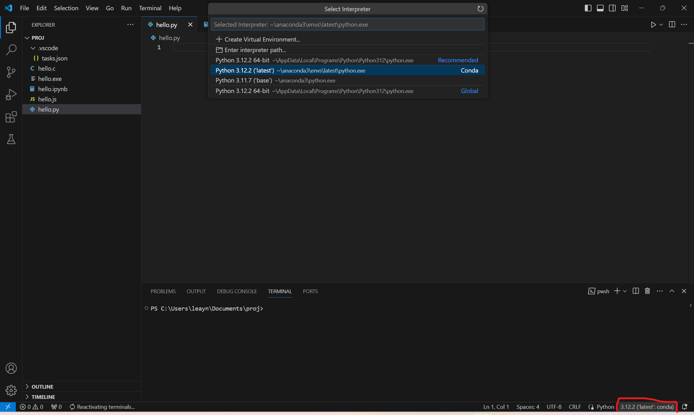
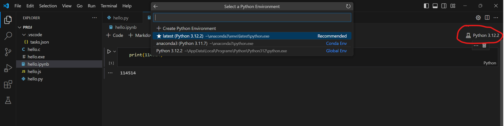

**conda安装与使用**

**安装**

**\[该类型的内容暂不支持下载\]**

一路下一步（不建议将anaconda添加至PATH）

**使用**

在开始菜单中搜索Anaconda，打开**Anaconda Prompt**

**虚拟环境**

虚拟环境：顾名思义，一个和外界隔离的虚拟环境，有点虚拟机的意思，只是没虚拟机那么虚拟的那么彻底，也没虚拟机占用的资源多。用虚拟环境的好处很多，打个比方，你同时有两个项目，两个项目分别需要依赖A和依赖B，而依赖A和依赖B又同时依赖于依赖C的不同版本（不兼容），这种情况在单一环境下是无法解决的，这就是**依赖地狱**！但如果使用虚拟环境，你就可以分别为两个项目建立两个互不干扰的虚拟环境。conda的虚拟环境甚至更强大（比venv强大），它可以让不同的虚拟环境使用不同版本的Python，还有一些其他更彻底的隔离措施。

说了这么多，旨在表明Anaconda核心在于虚拟环境（当然从头到尾都用base环境也不是不行）

在默认情况下（也就是没有新建任何虚拟环境），Anaconda有一个base环境。

**新建虚拟环境**

  -----------------------------------------------------------------------
  PowerShell\
  conda create -n yourEnvName python=3.11 numpy ipykernel \...

  -----------------------------------------------------------------------

python=3.11：指定python版本，也可以省略=3.11，这样会安装最新python版本

numpy ipykernel
\...：这个是指在创建时就安装的一些python包，也可以省略，但建议每次都带上ipykernel包，这个是jupyter
notebook的内核

**激活虚拟环境**

  -----------------------------------------------------------------------
  PowerShell\
  \# Windows\
  activate yourEnvName\
  \# Linux\
  source activate yourEnvName

  -----------------------------------------------------------------------

**退出虚拟环境**

  -----------------------------------------------------------------------
  PowerShell\
  \# Windows\
  conda deactivate yourEnvName\
  \# Linux\
  source deactivate yourEnvName

  -----------------------------------------------------------------------

**conda常用命令**

conda install xxx：给当前环境安装包

conda install -n env package：给env环境安装package包

conda remove xxx：给当前环境移除包

conda remove -n env package：给env环境移除package包

conda update xxx：更新当前环境某个包

conda update \--all：更新所有包

conda update conda：更新自身，也会更新与之相关的包

conda list：查看所有已经安装的包

conda env list：查看所有环境，当前环境会用\*标出来

conda remove -n env \--all：删除env环境

conda env remove -n env：上一条命令删除失败时可以试试这条

**conda频道（换源）**

你可能经常听说【换源】这个词。

+-----------------------------------------------------------------------+
| 在软件包管理的上下文中，如                                            |
| pip、apt或conda，**\"源\"**通常指的是存储和分发软件包的服务器或服务。 |
|                                                                       |
| 例如，对于Python的pip包管理器，源是一个托管Py                         |
| thon软件包的服务器，pip可以从这个服务器下载并安装软件包。PyPI（Python |
| Package                                                               |
| Index）                                                               |
| 是最常用的Python包源，但用户也可以使用其他源，如清华大学的PyPI镜像。  |
+-----------------------------------------------------------------------+

对于conda，源的概念被称为\"频道\"。频道是托管conda软件包的服务器或服务，用户可以从这些频道下载并安装软件包。Anaconda默认的频道包含了大多数常用的科学计算包，而conda-forge是一个由社区维护的频道，包含了许多在默认频道中找不到的包。

你可以通过conda config \--show
channels来查看你目前的频道列表。如以下是我个人的配置：

  -----------------------------------------------------------------------
  Plain Text\
  channels:\
  - conda-forge\
  - https://mirrors.nju.edu.cn/anaconda/pkgs/main/\
  - https://mirrors.nju.edu.cn/anaconda/pkgs/free/\
  - https://mirrors.tuna.tsinghua.edu.cn/anaconda/pkgs/free/\
  - defaults

  -----------------------------------------------------------------------

频道是有优先级的，越靠前的频道优先级越高。在安装/搜索conda包的时候，默认先从优先级高的频道开始搜索

你可以使用 conda config 命令来管理你的频道。以下是一些常用的操作：

**查看当前频道列表**：

conda config \--show channels

这将显示你当前的频道列表。

**添加新频道**：

conda config \--add channels new_channel

这将把 new_channel 添加到你的频道列表的末尾。

**将新频道添加到列表的开始**：

conda config \--prepend channels new_channel

这将把 new_channel 添加到你的频道列表的开始。

**删除频道**：

conda config \--remove channels old_channel

这将从你的频道列表中删除 old_channel。

**清空频道列表**：

conda config \--remove-key channels

这将清空你的频道列表。

  -----------------------------------------------------------------------
  opencv建议用conda-forge频道里的版本，可以用conda install -c conda-forge
  opencv来安装

  -----------------------------------------------------------------------

**在vsc中使用conda虚拟环境**

**在py文件中使用指定环境运行**

{width="5.75in" height="3.4375in"}

注：如果在选择了虚拟环境的情况下，按Ctrl+Shift+\`键打开终端的话，会自动激活相应虚拟环境。但最前面可能不会有(envName)的标识符。具体参见[Activate
Environments in Terminal Using Environment
Variables](https://github.com/microsoft/vscode-python/wiki/Activate-Environments-in-Terminal-Using-Environment-Variables)

**在ipynb文件中使用指定虚拟环境**

{width="5.75in" height="1.4375in"}

点击切换就行，注意，如果对应环境没装【ipykernel】这个包的话，会弹窗提示安装，所以正如前文所说，你可以在创建虚拟环境的时候就一并安装了，conda
create -n youEnv
ipykernel，这里甚至可以省略python，因为ipykernel依赖于python，它安装的时候会自动安装的。

**在Pycharm中**

电脑上没装，不演示了（我是vscode的卫道士（
