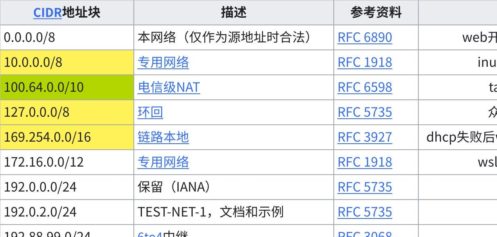
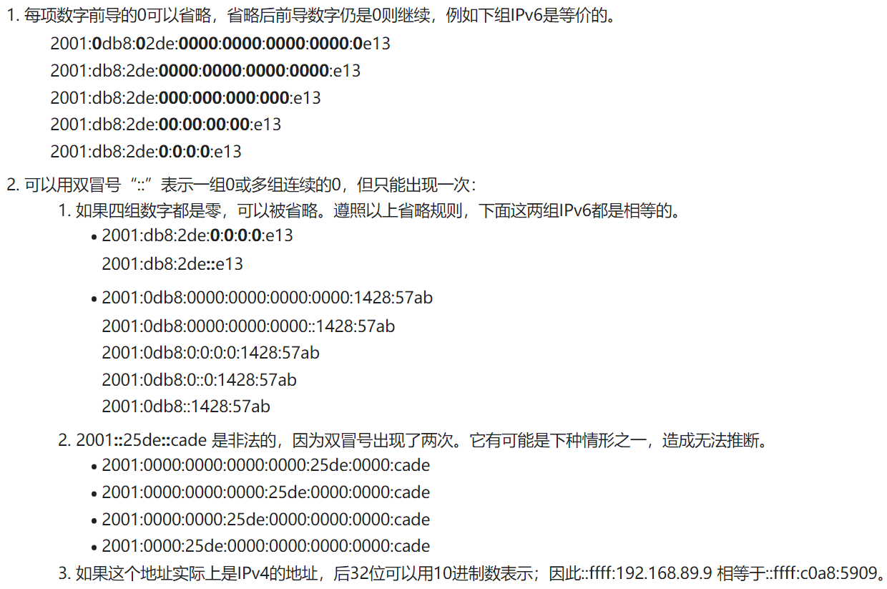

**ipv4和ipv6**

  -----------------------------------------------------------------------
  **TLDR（省流）**

  -----------------------------------------------------------------------

IPV4：形如xxx.xxx.xxx.xxx的地址，xxx取值范围为0\~255（端点0、255有特殊含义，一般取不到）

IPV6：IPv6地址通常表示为8组4个十六进制数，每组之间用冒号（:）分隔，例如：2001:0db8:85a3:0000:0000:8a2e:0370:7334。为了简化表示，IPv6地址允许省略前导零和使用双冒号来压缩连续的零段，但每个地址中双冒号只能出现一次。如前面那个就可以化简为2001:db8:85a3::8a2e:370:7334

省流结束

**IPV4**

**基本概念**

**IP地址**：IPv4地址由32位二进制数构成，通常分为4个字节（或称为8位组），每个字节范围从0到255，用点分十进制表示法表示，例如192.168.1.1。

**子网掩码**：用来指示IP地址中哪一部分是网络地址，哪一部分是主机地址。与IP地址一样，子网掩码也是32位的，网络部分用连续的1表示，主机部分用0表示。例如，255.255.255.0表示前24位是网络地址，后8位是主机地址。

**子网划分**

子网划分（Subnetting）是将一个较大的网络划分成若干个较小的网络的过程。它可以帮助组织内部管理IP地址、提高地址利用率、提高网络安全性和性能。通过改变子网掩码，可以将一个网络划分成多个子网。

**如何计算**

**网络地址**：通过将IP地址与子网掩码进行AND运算得到。例如，IP地址192.168.1.1与子网掩码255.255.255.0进行AND运算后得到网络地址192.168.1.0。

**广播地址**：将子网内的主机部分地址全部设置为1，用于在子网内广播消息。例如，对于子网掩码255.255.255.0，网络192.168.1.0的广播地址是192.168.1.255。

**可用地址范围**：网络地址和广播地址之间的地址用于分配给设备。继续上面的例子，192.168.1.1至192.168.1.254可用于分配。

**CIDR表示法**

CIDR（无类别域间路由）表示法是一种更灵活的表示IP地址和其对应子网掩码的方法，使用斜线后跟一个数字的形式，如192.168.1.0/24，其中"/24"表示前24位是网络地址，即子网掩码255.255.255.0。

CIDR（无类别域间路由）表示法中的子网掩码并不总是8的倍数。CIDR允许更灵活地分配IP地址，通过在IP地址后面添加斜线和一个数字（例如192.168.1.0/24）来表示。这个数字，称为前缀长度，表示网络地址部分的位数，它可以是从1到32之间的任何值，不仅仅是8、16或24这样8的倍数的值。

**CIDR示例**

**192.168.1.0/24**：这是比较常见的，表示子网掩码为255.255.255.0，网络部分占了24位。这意味着这个子网内可以有256-2=254个可用IP地址（减去的2个是网络地址和广播地址）。

**192.168.1.0/25**：这个例子中，子网掩码为255.255.255.128，表示网络部分占了25位。这样划分的子网可以容纳128-2=126个可用IP地址。这种情况下，192.168.1.0/24的地址空间被分成两个等大的子网。

**192.168.1.0/30**：在这种情况下，子网掩码为255.255.255.252，网络部分占了30位。这样的子网只能容纳4-2=2个可用IP地址，通常用于点对点链接。

**为什么会有非8倍数的CIDR？**

CIDR的设计目的是为了更有效地利用IP地址空间和更灵活地进行网络划分。通过允许任意长度的前缀，网络管理员可以根据实际需求创建大小不一的网络，而不是被迫使用传统的、固定大小的子网（如Class
A、B或C网络）。这种灵活性有助于减少IP地址的浪费，特别是在IP地址越来越稀缺的今天。

总之，CIDR通过提供非8的倍数的子网掩码长度，大大增加了网络设计的灵活性，使得IP地址资源的利用更加高效。

**注意事项**

**私有地址空间**：某些IP地址范围被设计为在私有网络内使用，而不是在互联网上路由。这些包括10.0.0.0/8、172.16.0.0/12和192.168.0.0/16。

**地址枯竭**：由于IPv4地址空间的有限性，加之分配不均等等问题，IPv4地址正逐渐枯竭。为此，IPv6被设计出来，以支持更多的地址空间。

**特殊用途的地址**

标黄的是一些常见的地址（都不是公网ip）

**点击图片可查看完整电子表格**

**IPV6**

IPv6（Internet Protocol Version
6）是因特网下一代协议，旨在替代IPv4。随着设备数量的增加，IPv4地址资源的枯竭已成为互联网发展的一个主要瓶颈。IPv6设计之初就致力于解决地址空间不足的问题，并引入了多项新特性以提高网络性能和安全性。

IPv6的最显著特点是其庞大的地址空间。IPv6地址长度为128位，理论上可以提供约$3.4 \times 10^{38}$个唯一IP地址，远远超过IPv4的约43亿个地址。这个庞大的地址空间解决了地址耗尽的问题，并且能够满足未来可预见的所有网络设备的需求。

**地址格式**

IPv6地址通常表示为8组4个十六进制数，每组之间用冒号（:）分隔，例如：2001:0db8:85a3:0000:0000:8a2e:0370:7334。为了简化表示，IPv6地址允许省略前导零和使用双冒号来压缩连续的零段，但每个地址中双冒号只能出现一次。

{width="5.75in" height="3.8125in"}

另外，::ffff:1.2.3.4 格式叫做**IPv4映射地址**。

  ---------------------------------------------------------------------------------------------------------------------------------------------------------------
  IPv4位址可以很容易的转化为IPv6格式。举例来说，如果IPv4的一个地址为135.75.43.52（十六进制为0x874B2B34），它可以被转化为0000:0000:0000:0000:0000:FFFF:874B:2B34
  或者::FFFF:874B:2B34。同时，还可以使用混合符号（IPv4-compatible address），则地址可以为::ffff:135.75.43.52。

  ---------------------------------------------------------------------------------------------------------------------------------------------------------------

  -------------------------------------------------------------------------------------------------------------------------------------
  由于同一非全局地址可能在同一范围的多个区域中使用（例如，在两条独立的物理链路中使用链路本地地址
  fe80::1），而且一个节点可能连接到同一范围的不同区域的接口（例如，一个路由器通常有多个接口连接到不同的链路）。IPv6新增了区域ID（Zone
  ID）加以区分，或称作用域ID（Scope ID）。作用域ID仅用于本地链接，使用百分号追加在地址后面。其内容特定于操作系统，例如Windows使用数字
  fe80::2%3 ，Linux使用网卡名字 fe80::2%eth0 。(\[7\]) 在URI中使用时，百分号需要进行编码，例如 fe80::a%en1 应显示为
  http://\[fe80::a%25en1\] 。

  -------------------------------------------------------------------------------------------------------------------------------------

**地址类型**

IPv6有几种类型的地址，包括单播地址、多播地址和任播地址。IPv6不再使用广播地址，而是使用多播地址来实现类似的功能。

**单播地址**：指向网络中的一个接口，用于一对一通信。

**多播地址**：指向一组接口，通常位于不同的主机上，用于一对多通信。

**任播地址**：也指向一组接口，但数据包只被送达给这组接口中的任意一个，通常是最近的一个，用于负载均衡和冗余。

**子网**

IPv6同样有子网的概念，但与IPv4在处理方式上有所不同。在IPv6中，子网的划分和管理是通过IPv6地址结构的一部分来实现的，更具灵活性和扩展性。

**IPv6地址结构**

IPv6地址由128位组成，通常表示为8组每组4个十六进制数。这128位通常被分为两个主要部分：网络前缀和接口标识符。

**网络前缀**：用于识别特定的网络。它的长度可以变化，但通常是64位，前缀长度会在地址中通过斜杠后跟数字的形式表示，例如2001:db8::/64。

**接口标识符**：用于识别网络内的具体接口（通常是设备）。在大多数情况下，这部分也是64位，保证了网络内部设备的唯一性。

**子网划分**

在IPv6中，子网划分主要是通过调整网络前缀的长度来实现的。例如，一个组织可能被分配到一个2001:db8::/48的地址范围。该组织可以进一步将这个范围细分为更小的子网，比如通过将前缀扩展到56位（2001:db8:0:xx00::/56）或者64位（2001:db8:0:xx00::/64），其中xx可以是任何十六进制值，用来定义不同的子网。

**子网的优势**

IPv6的子网化提供了几个重要的优势：

**简化的网络管理**：通过逻辑地组织网络，简化了路由和管理任务。

**安全性增强**：不同的子网可以应用不同的安全策略，提高了网络的整体安全性。

**更好的路由效率**：有效的子网划分可以减少路由表的大小，提高路由效率和网络性能。

**地址分配和管理**

与IPv4相比，IPv6的庞大地址空间使得每个子网都可以分配到几乎无限数量的地址，从而消除了地址不足的问题，并简化了地址分配和管理的过程。使用SLAAC或DHCPv6可以进一步自动化地址的配置过程，减少了网络管理员的工作负担。

总的来说，IPv6保留了子网的概念，并通过其地址结构的灵活性和大规模的地址空间，提供了更加高效和灵活的网络设计和管理方式。

**自动配置（SLAAC）**

IPv6支持无状态地址自动配置（SLAAC），使设备能够自动配置自己的IP地址，无需手动设置或依赖DHCP。设备可以通过监听路由器的广播来获取网络前缀，然后结合自己的MAC地址（通过EUI-64格式转换）生成IPv6地址的后64位。

无状态地址自动配置（Stateless Address Autoconfiguration,
SLAAC）是IPv6网络中一个重要的特性，它允许设备在没有手动配置和没有网络管理员干预的情况下，自动生成自己的IPv6地址。SLAAC极大地简化了网络配置过程，特别是在大型网络和动态环境中。下面将详细介绍SLAAC的工作原理。

**工作原理**

**路由器通告（Router Advertisement, RA）**:

IPv6网络中的路由器定期发送RA消息，这些消息通过ICMPv6协议广播到所有局域网中的设备。RA消息包含网络的前缀信息和其他配置参数。

**地址生成**:

当一个设备接收到RA消息后，它会使用RA中的网络前缀和自己的网卡MAC地址（通过EUI-64格式转换，或者使用隐私扩展）生成IPv6地址的后64位，从而形成一个完整的128位IPv6地址。

EUI-64格式涉及将48位MAC地址扩展为64位，方法是在MAC地址的中间插入FF:FE（16位），同时反转MAC地址的第七位（U/L位），以区分全球管理的地址和本地管理的地址。

**重复地址检测（Duplicate Address Detection, DAD）**:

在最终确定使用该地址之前，设备会进行DAD过程，确保局域网中没有其他设备已经使用了这个IPv6地址。这是通过发送特殊的ICMPv6消息完成的，如果没有收到表示地址已被占用的回应，则设备确认地址的唯一性并开始使用该地址。

**隐私扩展（Privacy Extensions）**:

由于使用EUI-64可能会暴露网卡MAC地址，带来隐私和安全问题，IPv6引入了隐私扩展（RFC
4941），使得设备可以生成临时的、不基于MAC地址的IPv6地址，用于隐藏设备的物理身份。

**特点**

**无状态**:\
SLAAC被称为"无状态"，因为路由器不需要跟踪网络上每个设备的地址分配情况，设备自己生成地址且保证其唯一性。

**自我配置**:\
设备无需人工干预即可自动加入到IPv6网络中，极大简化了网络管理。

**动态性**:\
当网络前缀发生变化时，设备可以快速地生成新的IPv6地址并加入网络，保证网络的灵活性和扩展性。

**与DHCPv6的关系**

SLAAC和DHCPv6是IPv6中用于地址配置的两种不同机制。SLAAC完全自动，而DHCPv6则提供了更多控制，包括地址分配、租期管理以及其他配置选项（如DNS服务器地址）。在某些网络中，两者可以同时使用，例如使用SLAAC进行地址配置，同时使用DHCPv6分发其他网络配置信息。

在不适合使用IPv6无状态地址自动配置的场景下，网络可以使用有状态配置（[DHCPv6](https://zh.wikipedia.org/wiki/DHCPv6)），或者使用静态方法手动配置。

**安全性**

IPv6设计时就考虑了安全性，IPsec（一种网络层安全协议）是IPv6的标准组成部分，而在IPv4中，IPsec是可选的。IPsec支持数据加密和身份验证，保证数据在传输过程中的安全性。

**性能改进**

IPv6还引入了一些其他特性，如简化的包头格式，减少了路由器处理包的复杂度，提高了转发效率。此外，IPv6原生支持移动性，允许用户在不丢失连接的情况下，更换网络。

**兼容性**

IPv4和IPv6是两个完全不同的协议，它们之间不直接兼容。为了实现平滑过渡，网络上部署了多种转换技术，如隧道技术（封装IPv6数据包在IPv4中传输）和双栈技术（同时支持IPv4和IPv6）。

IPv6的引入和普及是一个长期过程，但随着IPv4地址资源的枯竭和互联网设备的增加，IPv6的重要性日益凸显。它不仅解决了地址空间的问题，还提供了更好的网络性能、安全性和可扩展性。

**特殊地址**

IANA维护官方的IPv6地址空间列表。全局的单播地址的分配可在各个[区域互联网注册管理机构](https://zh.wikipedia.org/wiki/%E5%8C%BA%E5%9F%9F%E4%BA%92%E8%81%94%E7%BD%91%E6%B3%A8%E5%86%8C%E7%AE%A1%E7%90%86%E6%9C%BA%E6%9E%84)或
GRH DFP 页面找到。

IPv6中有些地址是有特殊含义的：

1\. **未指定地址**

::/128－所有比特皆为零的地址称作未指定地址。这个地址不可指定给某个网络接口，并且只有在主机尚未知道其来源IP时，才会用于软件中。路由器不可转送包含未指定地址的数据包。

2\.
[**链路本地地址**](https://zh.wikipedia.org/wiki/%E9%93%BE%E8%B7%AF%E6%9C%AC%E5%9C%B0%E5%9C%B0%E5%9D%80)

::1/128－是一种单播[绕回](https://zh.wikipedia.org/wiki/%E5%9B%9E%E7%8E%AF)地址。如果一个应用程序将数据包送到此地址，IPv6堆栈会转送这些数据包绕回到同样的虚拟接口（相当于IPv4中的[127.0.0.1/8](https://zh.wikipedia.org/wiki/127.0.0.1)）。

fe80::/10－这些链路本地地址指明，这些地址只在区域连线中是合法的，这有点类似于IPv4中的169.254.0.0/16。

3\.
[**唯一区域地址**](https://zh.wikipedia.org/w/index.php?title=%E5%94%AF%E4%B8%80%E5%8C%BA%E5%9F%9F%E5%9C%B0%E5%9D%80&action=edit&redlink=1)

fc00::/7－唯一区域地址（ULA，unique local
address）只可用于本地通信，类似于[IPv4](https://zh.wikipedia.org/wiki/IPv4)的[专用网络](https://zh.wikipedia.org/wiki/%E4%B8%93%E7%94%A8%E7%BD%91%E7%BB%9C)地址10.0.0.0/8、172.16.0.0/12和192.168.0.0/16。这定义在RFC
4193中，是用来取代站点本地位域。这地址包含一个40比特的[伪随机数](https://zh.wikipedia.org/wiki/%E4%BC%AA%E9%9A%8F%E6%9C%BA%E6%95%B0)，以减少当网站合并或数据包误传到网络时碰撞的风险。这些地址除了只能用于区域外，还具备全局性的范畴，这点违反了唯一区域位域所取代的站点本地地址的定义。

4\. **多播地址**

ff00::/8－这个前置表明定义在\"IP Version 6 Addressing
Architecture\"（[RFC
4291](https://tools.ietf.org/html/rfc4291)）中的[多播地址](https://zh.wikipedia.org/w/index.php?title=%E5%A4%9A%E6%92%AD%E4%BD%8D%E5%9D%80&action=edit&redlink=1)(\[12\])。其中，有些地址已用于指定特殊协议，如ff0X::101对应所有区域的NTP服务器（[RFC
2375](https://tools.ietf.org/html/rfc2375)）。

5\. **请求节点多播地址（Solicited-node multicast address）**

ff02::1:FFXX:XXXX－XX:XXXX为相对应的单播或任播地址中的三个最低的字节。

6\. **IPv4转译地址**

::ffff:x.x.x.x/96－用于[IPv4映射地址](https://zh.wikipedia.org/w/index.php?title=IPv4%E6%98%A0%E5%B0%84%E4%BD%8D%E5%9D%80&action=edit&redlink=1)。（参见以下的[转换机制](https://zh.wikipedia.org/wiki/IPv6#%E8%BD%89%E6%8F%9B%E6%A9%9F%E5%88%B6)）。

2001::/32－用于[Teredo隧道](https://zh.wikipedia.org/wiki/Teredo%E9%9A%A7%E9%81%93)。

2002::/16－用于[6to4](https://zh.wikipedia.org/wiki/6to4)。

7\. **ORCHID**

2001:10::/28－ORCHID (Overlay Routable Cryptographic Hash
Identifiers)（[RFC
4843](https://tools.ietf.org/html/rfc4843)）。这些是不可绕送的IPv6地址，用于加密散列识别。

8\. **文件**

2001:db8::/32－这前置用于文件（[RFC
3849](https://tools.ietf.org/html/rfc3849)）。这些地址应用于IPV6地址的示例中，或描述网络架构。

9\. **遭舍弃或删除的用法**

::/96－这个前置曾用于[IPv4兼容地址](https://zh.wikipedia.org/w/index.php?title=IPv4%E7%9B%B8%E5%AE%B9%E4%BD%8D%E5%9D%80&action=edit&redlink=1)，现已删除。

fec0::/10－这个站点本地前置指明这地址只在组织内合法。它已在2004年9月的RFC3879中舍弃，并且新系统不应该支持这类型的地址。

**NAT、路由、端口转发**

  -----------------------------------------------------------------------
  提起这个我就不困了啊

  -----------------------------------------------------------------------

困了，明天再写

参见[NAT穿透](https://e0w6uca6qjf.feishu.cn/wiki/IC7uw80adit7KUk8OWgcB1jWnNf)
