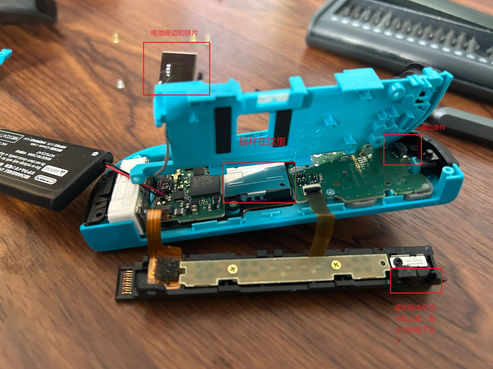
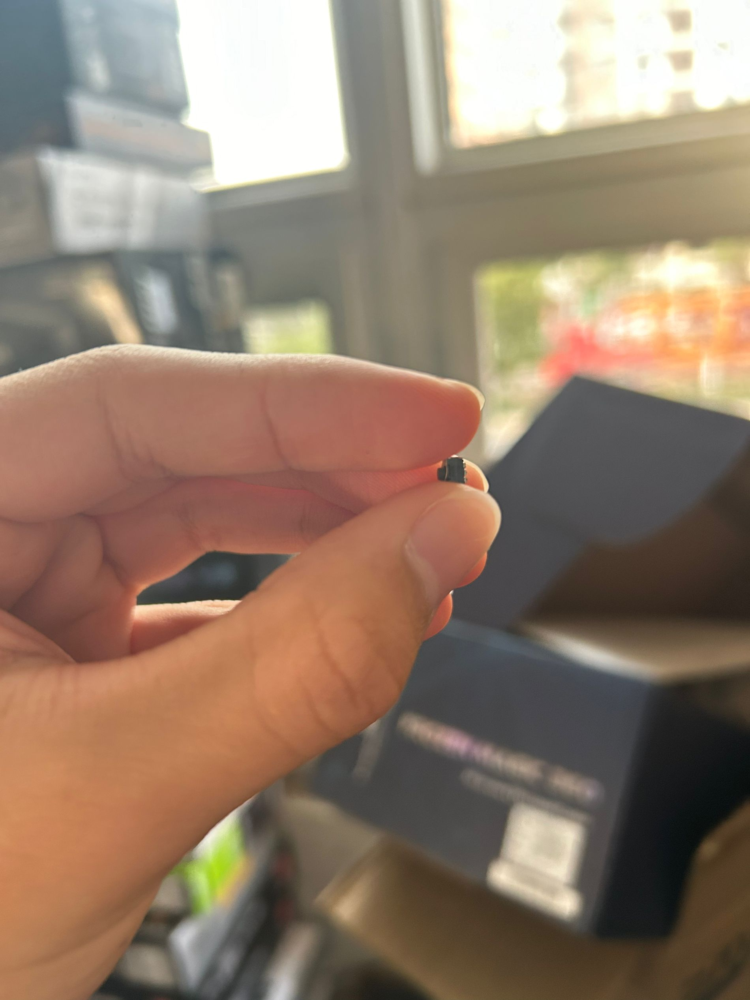

# joycon手柄维修

## 步骤（此次为肩键失灵）：

1.Y型螺丝刀将背部四个螺丝卸下。
（注意：Y型螺丝刀有多种大小，joycon螺丝质地较软，刀头选择不当很容易滑丝。）

2.将滑轨从主板另一半的壳子上卸下，只有一个螺丝（十字）。

3.将电池扣下，有些手柄电池下有一层胶，分布在电池左右两侧，用翘片把胶铲掉。拿下电池后将电池前贴片取下。随后将电池所在的壳子取下，有三个螺丝（十字），分别在左上角 *1和右上角扳机附近 *2。

附图拆至如下情况：

4.如果需要更换摇杆则还要将摇杆附近螺丝卸下并更换摇杆，此次为肩键没有触感，弹簧被摔错位了。

(摇杆更换可参考https://www.bilibili.com/video/BV1n4411q7hS/?spm_id_from=333.337.search-card.all.click&vd_source=33370fa4b49d20fff9393bbea9c70570)

（附第二个手柄维修，问题为肩键回弹按压正常但没有反应）：

拆开后发现微动与主板分离（图片红色圈出位置为板子上的原位置，可对比上图）

微动元件图片：

需要购买微动原件，然后焊回去，还未尝试元件还没到。
### 注意点：

1.全程无需将电池断电，如果想方便点也可以将所有排线拔下。

2.导轨下有一个黑色的按钮不要忘记装回去，是让导轨与switch分离用的！！