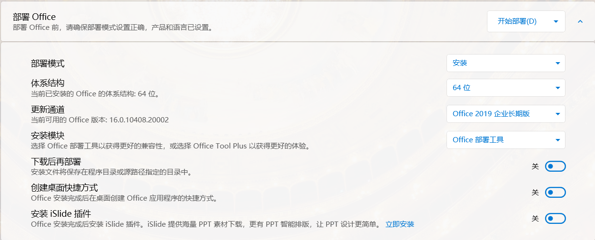
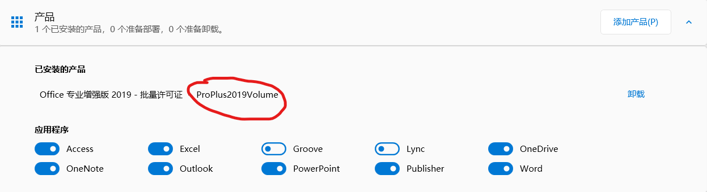
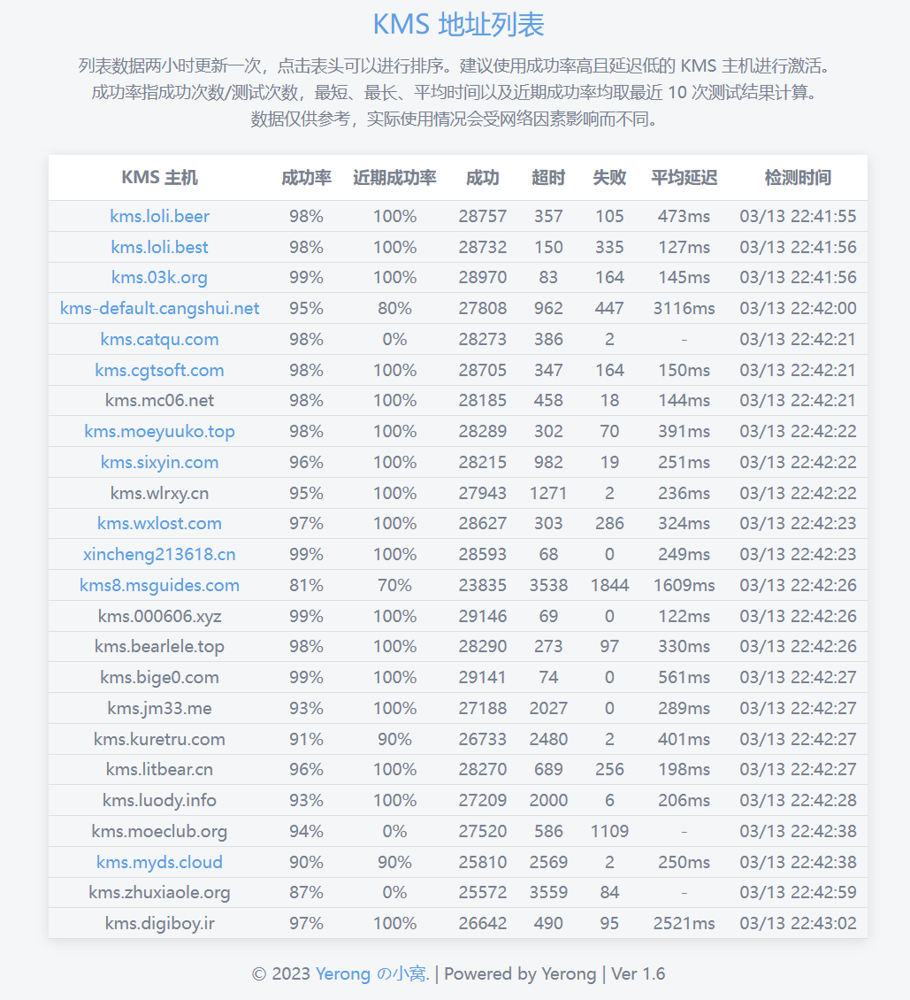
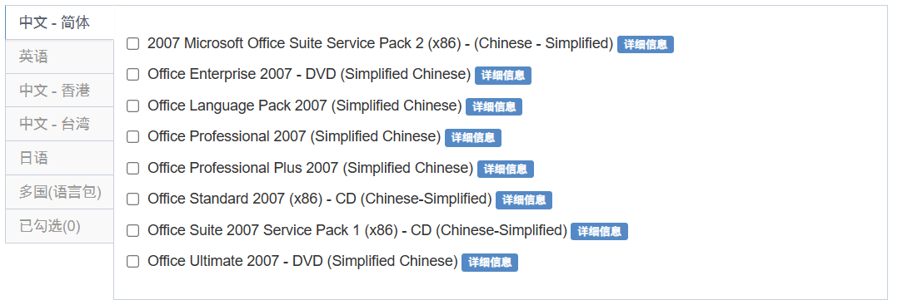

**office的安装**

**使用office tool plus安装**

**部署**

首先使用[官网](https://otp.landian.vip/zh-cn/)下载office tool plus。

解压后打开exe文件，在部署界面，添加产品，推荐选择批量许可证版本。

{width="5.75in" height="0.375in"}

然后选择需要的应用，根据需求去安装需要的应用，不需要每次都最大安装。

{width="5.75in"
height="0.6770833333333334in"}

找到合适版本后再进行添加语言

{width="5.75in" height="1.0in"}

随后修改部署的方式

{width="5.75in"
height="2.3229166666666665in"}

推荐选择长期版通道。

**激活**

**自动激活**

按下快捷键 Ctrl + Shift +
P，打开命令框，按需复制下面的命令，粘贴后回车以执行操作。

输入以下指令可以自动激活office

  -----------------------------------------------------------------------
  Bash\
  ospp /inslicid \<填版本号\> /sethst:kms.loli.beer /setprt:1688 /act

  -----------------------------------------------------------------------

版本号可以在产品界面的已安装处找到

{width="5.75in" height="1.5625in"}

**手动kms激活**

在激活页面首先打开许可证管理，并点击安装许可证，从许可证列表中找出适合当前部署版本的许可证。

{width="5.75in"
height="1.3854166666666667in"}

随后设置kms主机，可以从[kms列表](https://www.coolhub.top/tech-articles/kms_list.html)中找到合适的kms网址输入，然后点击设置主机即可使用kms。

{width="5.75in" height="6.3125in"}

{width="5.75in"
height="0.8541666666666666in"}

最后再点击许可证管理右边的激活按钮即可完成激活，然后进入word中查看激活情况，以2019为例，先新疆一个word文档后点击工具栏上的文件，随后点击账户，看到以下信息就算激活成功。

{width="4.135416666666667in"
height="3.40625in"}

Office tool
plus更详细激活方式参考[官方教程](https://www.coolhub.top/archives/14#:~:text=%E4%BD%BF%E7%94%A8%20Office%20Tool%20Plus%20%E8%87%AA%E5%8A%A8%E6%BF%80%E6%B4%BB%20Office)。

**安装低版本office**

老版本的office可以从[msdn](https://msdn.itellyou.cn/)上获取到。

{width="5.75in"
height="1.90625in"}

点开详细信息后，找到以ed2k开头的一串连接。ed2k可以使用迅雷或者[emule](https://www.emulefans.com/news/emule/emule-official/)(需要魔法)下载

在安装完成后可以用[HEU_KMS_Activator](https://e0w6uca6qjf.feishu.cn/wiki/SCXnwkOv0iPge3kBtl7cVU6dnBb)来一键激活。
