**图吧工具箱**

**下载**

附上下载连接https://www.tbtool.cn/，不要跑到奇怪的网站去下载！

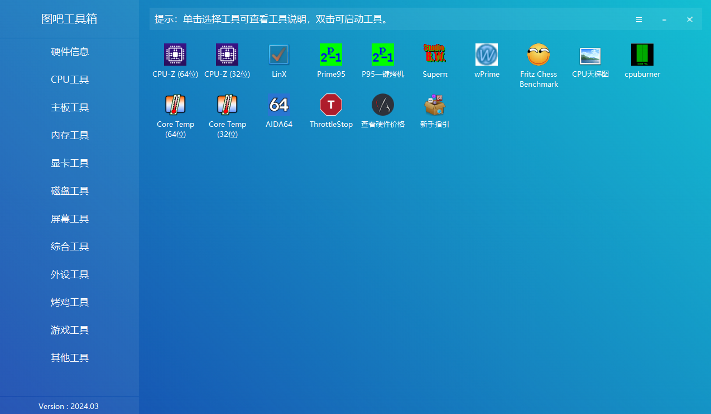{width="5.75in"
height="3.3541666666666665in"}

**基础信息查看**

**CPU-Z**

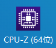{width="0.96875in"
height="0.8333333333333334in"}

cpu-z一般用于查看cpu的一些基础性能

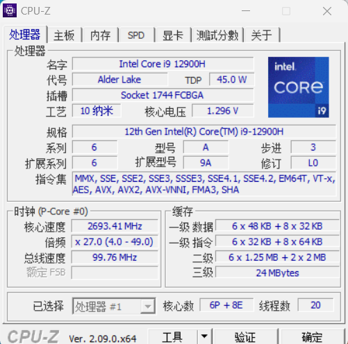{width="5.21875in"
height="5.166666666666667in"}

同时也可以对cpu进行跑分比较

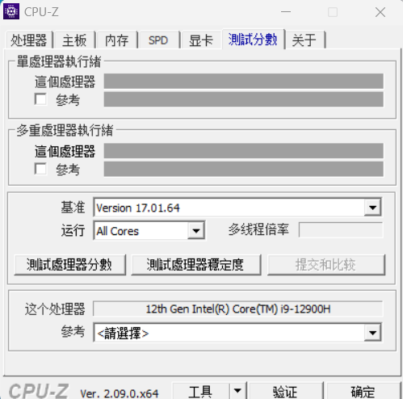{width="5.197916666666667in"
height="5.145833333333333in"}

**GPU-Z**

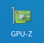{width="0.8958333333333334in"
height="0.875in"}

该软件可以看到GPU的一些基础信息。

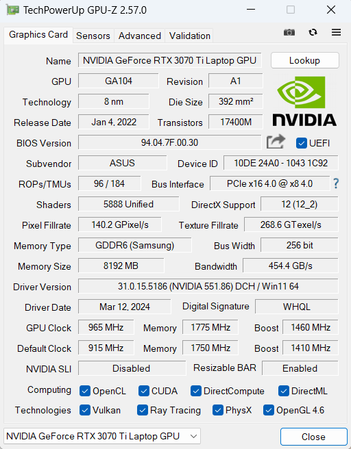{width="5.333333333333333in"
height="6.833333333333333in"}

**烤机工具**

**Aida64**

{width="0.8229166666666666in"
height="0.7708333333333334in"}

Aida64是我们常用的烤机测温软件，功能十分强大。

**查看核心温度**

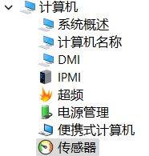{width="1.9375in" height="2.03125in"}

在计算机-传感器项目中可以看到电脑的温度信息如下

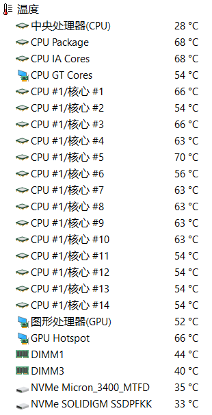{width="3.2291666666666665in"
height="6.3125in"}

**查看温度墙**

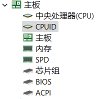{width="2.2708333333333335in"
height="2.0625in"}

在主板-CPUID下的过热保护温度栏目可以看到设定的温度墙。

{width="4.5in" height="0.21875in"}

**查看电池状况**

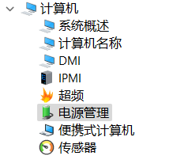{width="2.28125in"
height="2.0520833333333335in"}

在计算机-电源管理下可以看到基础的电池信息

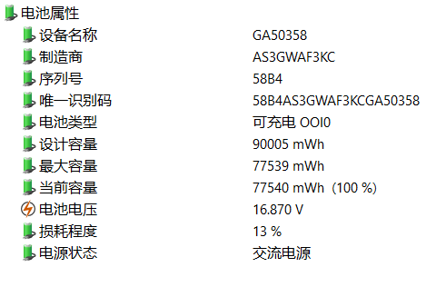{width="5.0in"
height="3.2916666666666665in"}

**稳定性测试（烤机）**

在软件上方工具栏中点击下方按钮

{width="0.3333333333333333in"
height="0.2708333333333333in"}

可以进入稳定性测试界面：

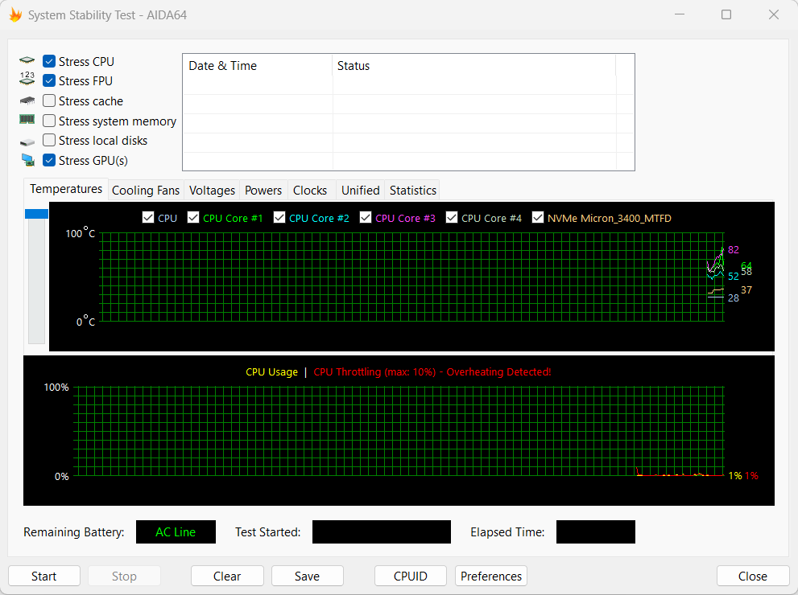{width="5.75in"
height="4.291666666666667in"}

我们一般只需要对CPU、FPU、GPU三项进行测试，选择好后点击start即可开始烤机。

**CpuBurner**

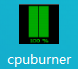{width="0.8125in"
height="0.71875in"}

一键跑满cpu，常用于复现cpu降频的问题。

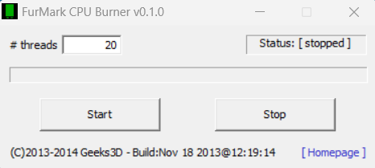{width="4.854166666666667in"
height="2.1770833333333335in"}

**FurMark**

{width="0.78125in"
height="0.8229166666666666in"}

用于单烤显卡，用于检验温度是否过高，

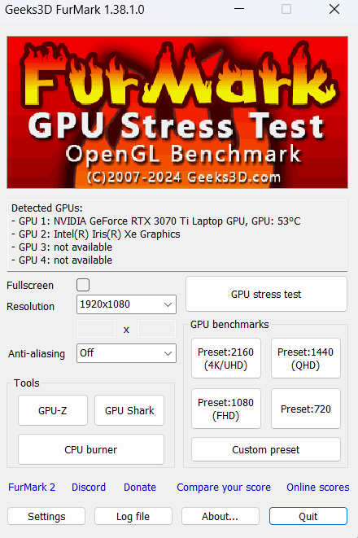{width="4.583333333333333in"
height="6.885416666666667in"}

我们烤机的时候只需调整Resolutino项的分辨率即可，然后即可烤机。

但需要注意的是一般furmark会跑不满GPU。

**磁盘工具**

**DiskInfo**

{width="0.9270833333333334in"
height="0.9791666666666666in"}

该软件可以看到硬盘的基础信息

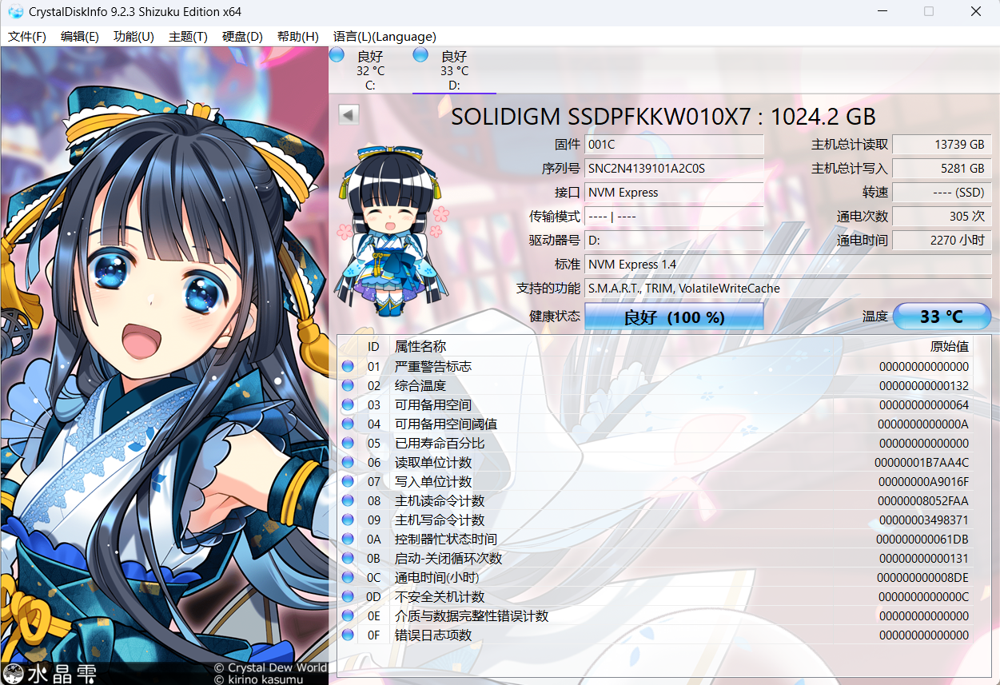{width="5.75in" height="3.9375in"}

**CrystalDiskMark**

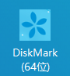{width="0.9375in"
height="1.0104166666666667in"}

该软件可以一键对硬盘进行测速

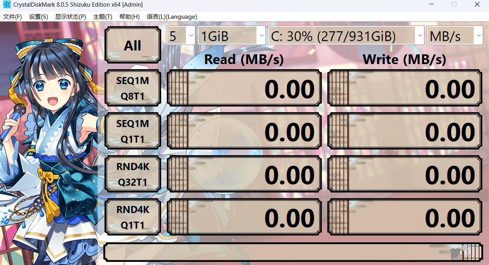{width="5.75in"
height="3.1145833333333335in"}

测试项目按顺序分别为：

1.顺序读写，位深1024K，1线程8队列的测试速度

2.顺序读写，位深1024K，1线程1队列测试速度

3.随机读写，位深1024\*4K，[1线程]{.underline}32队列的测试速度

4.随机读写，位深1024\*4K，一线程一队列的测试速度

一般只需要看第一项的测试速度即可，硬盘商家给的一般也是第一项的数据。

**HDTune**

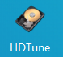{width="0.8125in"
height="0.7395833333333334in"}

HDTune用来测试机械硬盘的速度。

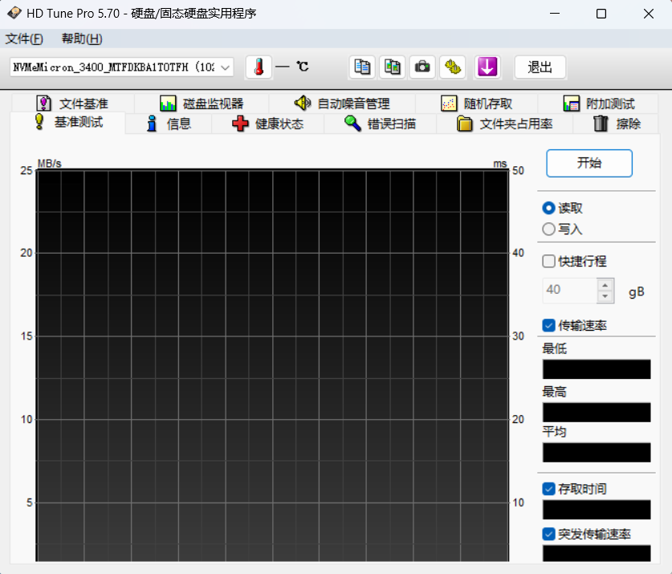{width="5.75in" height="4.90625in"}

点击开始即可使用。

**外设测试**

**键盘按键测试**

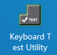{width="0.9895833333333334in"
height="0.9583333333333334in"}

我们在外设工具中找到Keyboard Test
Utillity，打开后将每个键都按一边即可知道键盘是否正常工作

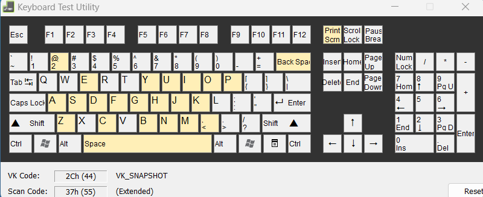{width="5.75in" height="2.34375in"}

**屏幕测试**

{width="0.9791666666666666in"
height="0.78125in"}

在屏幕工具中的在线屏幕测试栏目。点开后可以在网站上自行测试。

{width="0.9791666666666666in"
height="0.7708333333333334in"}

而UFO测试则可以测试屏幕的刷新率。

**其他工具**

**Geek Uninstaller**

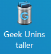{width="0.8958333333333334in"
height="0.9375in"}

打开即可使用，用于删除软件，可以强制清理某些流氓小强软件。

+-----------------------------------------------------------------------+
| Geek Uninstaller 是一款专业的 Windows 软件卸载工具，只有 6M           |
| 大小，非常轻巧方便。                                                  |
|                                                                       |
| 软件完全免费 & 干净简洁 & 无广告，单文件绿色版，解压即用。            |
|                                                                       |
| 官网：[Geek Uninstaller - the best FREE                               |
| uninst                                                                |
| aller](https://link.zhihu.com/?target=https%3A//geekuninstaller.com/) |
|                                                                       |
| 下载：[Geek Uninstaller                                               |
| 绿色版](                                                              |
| https://link.zhihu.com/?target=https%3A//pan.quark.cn/s/20c81ce7f367) |
|                                                                       |
| **彻底清除卸载残留**                                                  |
|                                                                       |
| 打开 Geek                                                             |
| Uninstaller，主界面列出了                                             |
| 我们电脑上安装的所有软件列表。最近安装或修改过的，会以橙色突出显示。  |
|                                                                       |
| 右键点击要卸载的软件 →                                                |
| 卸载。软件会自动扫                                                    |
| 描卸载程序残留的文件和注册表等，一键删除所有残余垃圾，保持电脑清洁！  |
|                                                                       |
| **一键卸载 Windows 商店应用**                                         |
|                                                                       |
| 软件还支持卸载 Windows 商店应用。                                     |
|                                                                       |
| 点击菜单栏中的「查看 - Windows Store Apps」，即可查看安装的 UWP       |
| 应用，同样通过右键菜单进行卸载。                                      |
|                                                                       |
| **给力的强制删除模式**                                                |
|                                                                       |
| 有些软件本身不带卸载程序                                              |
| （流氓软件不少），比较"固执"，或者程序损坏等，无法通过正常方法卸载。  |
|                                                                       |
| 就可以使用「强制删除」功能，强制删除并清理该软件相关的程序文件。      |
|                                                                       |
| **快捷导航**                                                          |
|                                                                       |
| 快捷导航是一个不起眼但很实用的功能。                                  |
|                                                                       |
| 右键可以直接打开软件的「注册表                                        |
| 条目」和「安装文件目录」，进入官网。在查找或者修改软件文件时很方便。  |
|                                                                       |
| 不过普通用户可能不太常用到。                                          |
|                                                                       |
| **纯绿色，不流氓**                                                    |
|                                                                       |
| Geek Uninstaller 本身就是一款单文件的绿色软件，解压后只有一个 6M      |
| 大小的 exe 运行文件。                                                 |
|                                                                       |
| 可以放在电脑上或者 U 盘里使用，不需要了直接删除就行。纯绿色，不流氓！ |
|                                                                       |
| **更多：Geek Uninstaller 专业版？**                                   |
|                                                                       |
| 对于大部分用户来说，免费的 Geek Uninstaller 足够日常使用了。          |
|                                                                       |
| 如果觉得                                                              |
| 不够用，或者想要更专业更强的卸载工具，再或者就是单纯地想支持下软件。  |
| \[狗头. jpg\]                                                         |
|                                                                       |
| Geek 确实还有一个专业版------Uninstall Tool。                         |
|                                                                       |
| 官网：[Uninstall Tool - Unique and Powerful                           |
| Uninstaller](htt                                                      |
| ps://link.zhihu.com/?target=https%3A//crystalidea.com/uninstall-tool) |
|                                                                       |
| 正版地址：[Uninstall Tool - 多功能专业级卸载工具                      |
| 永久版](https://link.zhihu.com/?                                      |
| target=https%3A//store.lizhi.io/site/products/id/63%3Fcid%3D2yj7gln9) |
|                                                                       |
| 除了常规的卸载清理，还有安装追踪（*这个                               |
| 功能很强！*）、软件自启动管理、分类管理、批量卸载等，功能更强更全面。 |
|                                                                       |
| Uninstall Tool 与 Geek                                                |
| 相比已经完全是两个软件了                                              |
| 。永久版可以终身使用，也确实物有所值，是个在全球都很知名的卸载工具。  |
|                                                                       |
| *注意：删除残留文件时不要直接点全删，记得先确认下，避免误删。*        |
|                                                                       |
| **结语**                                                              |
|                                                                       |
| Geek Uninstaller                                                      |
| 免费干净，小巧易用，卸载效果也不错。想要更多功能可以用它的专业版      |
| Uninstall Tool。                                                      |
|                                                                       |
| 相比于使用软件自带的卸载程序，不仅能释放存储空间，                    |
| 保持电脑环境干净；也有效避免了无用注册表等拖累系统，使电脑高效运行。  |
|                                                                       |
| 同步自文档:                                                           |
| <https://e0w6uca6qjf.fe                                               |
| ishu.cn/docx/SbWqdzjvooyDUgx3PqQcxSFcnod#HvOid0IR5s1Ketb1O03ci0OunfJ> |
+-----------------------------------------------------------------------+
