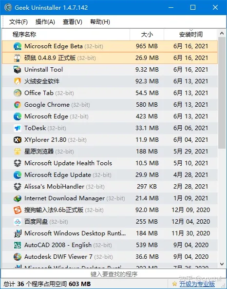
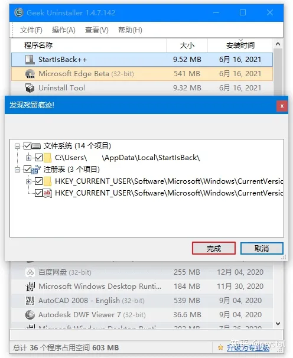
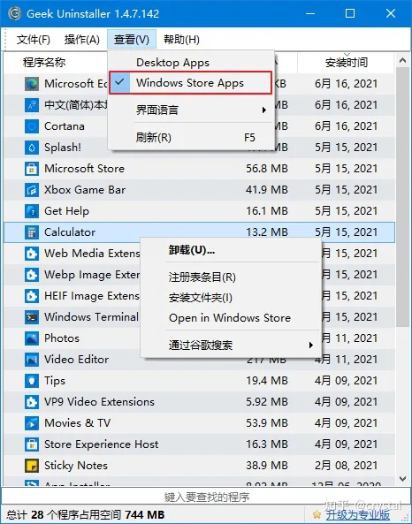
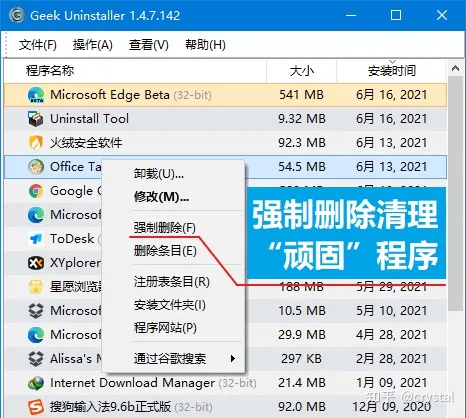
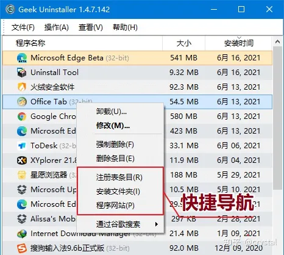
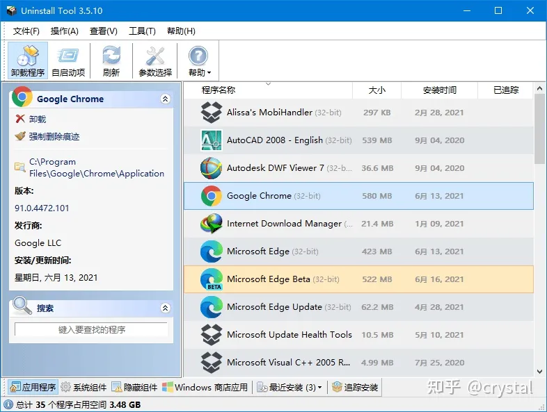

**清C盘流程**

**工具介绍**

  --------------------------------------------------------------------------------------------------------------------------
  以下工具在【图吧工具箱】均中有收录，具体参见[图吧工具箱](https://e0w6uca6qjf.feishu.cn/wiki/CrAYwE0aJiuEkzk19mVcJj5anKc)

  --------------------------------------------------------------------------------------------------------------------------

**SpaceSniffer**

主要功能如图

**\[0b70f03e-2340-11eb-a0c0-0e044a912ed5.mp4\]**

**Geek Uninstaller**

+-----------------------------------------------------------------------+
| Geek Uninstaller 是一款专业的 Windows 软件卸载工具，只有 6M           |
| 大小，非常轻巧方便。                                                  |
|                                                                       |
| 软件完全免费 & 干净简洁 & 无广告，单文件绿色版，解压即用。            |
|                                                                       |
| 官网：[Geek Uninstaller - the best FREE                               |
| uninst                                                                |
| aller](https://link.zhihu.com/?target=https%3A//geekuninstaller.com/) |
|                                                                       |
| 下载：[Geek Uninstaller                                               |
| 绿色版](                                                              |
| https://link.zhihu.com/?target=https%3A//pan.quark.cn/s/20c81ce7f367) |
|                                                                       |
| **彻底清除卸载残留**                                                  |
|                                                                       |
| 打开 Geek                                                             |
| Uninstaller，主界面列出了                                             |
| 我们电脑上安装的所有软件列表。最近安装或修改过的，会以橙色突出显示。  |
|                                                                       |
| {width="4.854166666666667in"  |
| height="6.177083333333333in"}                                         |
|                                                                       |
| 右键点击要卸载的软件 →                                                |
| 卸载。软件会自动扫                                                    |
| 描卸载程序残留的文件和注册表等，一键删除所有残余垃圾，保持电脑清洁！  |
|                                                                       |
| {width="5.166666666666667in"  |
| height="6.3125in"}                                                    |
|                                                                       |
| **一键卸载 Windows 商店应用**                                         |
|                                                                       |
| 软件还支持卸载 Windows 商店应用。                                     |
|                                                                       |
| 点击菜单栏中的「查看 - Windows Store Apps」，即可查看安装的 UWP       |
| 应用，同样通过右键菜单进行卸载。                                      |
|                                                                       |
| {width="4.854166666666667in"  |
| height="6.177083333333333in"}                                         |
|                                                                       |
| **给力的强制删除模式**                                                |
|                                                                       |
| 有些软件本身不带卸载程序                                              |
| （流氓软件不少），比较"固执"，或者程序损坏等，无法通过正常方法卸载。  |
|                                                                       |
| 就可以使用「强制删除」功能，强制删除并清理该软件相关的程序文件。      |
|                                                                       |
| {width="4.854166666666667in"  |
| height="4.354166666666667in"}                                         |
|                                                                       |
| **快捷导航**                                                          |
|                                                                       |
| 快捷导航是一个不起眼但很实用的功能。                                  |
|                                                                       |
| 右键可以直接打开软件的「注册表                                        |
| 条目」和「安装文件目录」，进入官网。在查找或者修改软件文件时很方便。  |
|                                                                       |
| {width="4.854166666666667in"  |
| height="4.354166666666667in"}                                         |
|                                                                       |
| 不过普通用户可能不太常用到。                                          |
|                                                                       |
| **纯绿色，不流氓**                                                    |
|                                                                       |
| Geek Uninstaller 本身就是一款单文件的绿色软件，解压后只有一个 6M      |
| 大小的 exe 运行文件。                                                 |
|                                                                       |
| 可以放在电脑上或者 U 盘里使用，不需要了直接删除就行。纯绿色，不流氓！ |
|                                                                       |
| **更多：Geek Uninstaller 专业版？**                                   |
|                                                                       |
| 对于大部分用户来说，免费的 Geek Uninstaller 足够日常使用了。          |
|                                                                       |
| 如果觉得                                                              |
| 不够用，或者想要更专业更强的卸载工具，再或者就是单纯地想支持下软件。  |
| \[狗头. jpg\]                                                         |
|                                                                       |
| Geek 确实还有一个专业版------Uninstall Tool。                         |
|                                                                       |
| 官网：[Uninstall Tool - Unique and Powerful                           |
| Uninstaller](htt                                                      |
| ps://link.zhihu.com/?target=https%3A//crystalidea.com/uninstall-tool) |
|                                                                       |
| 正版地址：[Uninstall Tool - 多功能专业级卸载工具                      |
| 永久版](https://link.zhihu.com/?                                      |
| target=https%3A//store.lizhi.io/site/products/id/63%3Fcid%3D2yj7gln9) |
|                                                                       |
| 除了常规的卸载清理，还有安装追踪（*这个                               |
| 功能很强！*）、软件自启动管理、分类管理、批量卸载等，功能更强更全面。 |
|                                                                       |
| {width="5.583333333333333in"  |
| height="4.208333333333333in"}                                         |
|                                                                       |
| Uninstall Tool 与 Geek                                                |
| 相比已经完全是两个软件了                                              |
| 。永久版可以终身使用，也确实物有所值，是个在全球都很知名的卸载工具。  |
|                                                                       |
| *注意：删除残留文件时不要直接点全删，记得先确认下，避免误删。*        |
|                                                                       |
| **结语**                                                              |
|                                                                       |
| Geek Uninstaller                                                      |
| 免费干净，小巧易用，卸载效果也不错。想要更多功能可以用它的专业版      |
| Uninstall Tool。                                                      |
|                                                                       |
| 相比于使用软件自带的卸载程序，不仅能释放存储空间，                    |
| 保持电脑环境干净；也有效避免了无用注册表等拖累系统，使电脑高效运行。  |
+-----------------------------------------------------------------------+

**给C盘扩容**

参见【DiskGenius】
