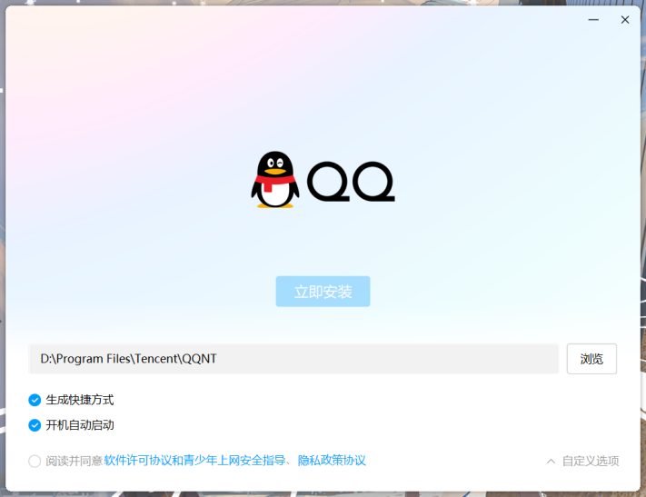
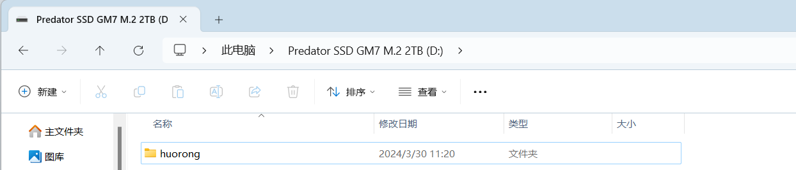
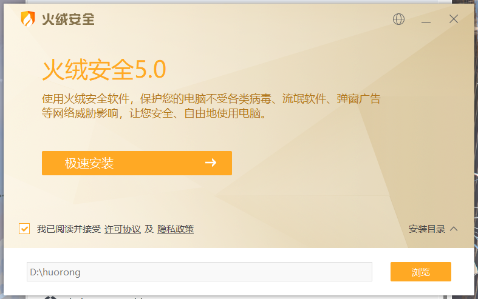
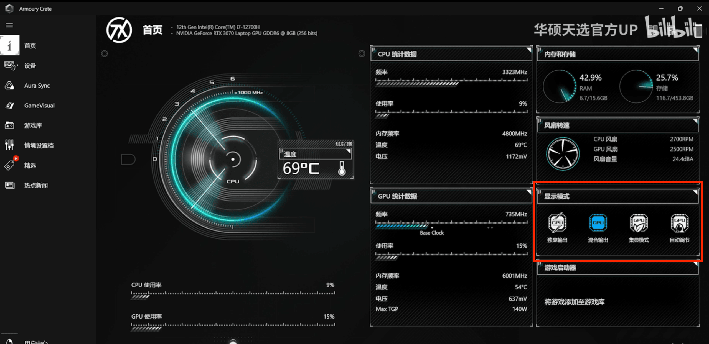
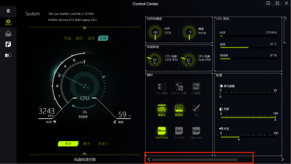
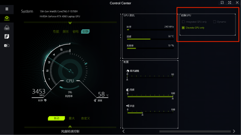

**用户需要学会的软件使用**

**如何搜索**

欢迎来到互联网时代我的朋友，人类的所有知识~~好叭至少是很大一部分~~都可以通过互联网获得，而搜索引擎将是你的最好帮手。

事实上，如果你真的学会了如何使用搜索引擎，那么下面的文章对你而言只能是众多参考文献的一部分。

**选择搜索引擎**

不幸的是，大厂的搜索引擎或多或少有些置顶广告，百度尤其严重，就我个人而言会推荐使用bing。当然也可以使用一些元搜索引擎比如https://search.fuyeor.com

**哪些是广告**

出于一些法规，搜索引擎会标明哪些条目是靠广告排到前面的。

**哪些是冒牌网站**

有的冒牌网站可以做的以假乱真，但是只需要看一点，就是他的网址就能看出问题。如果是首页在那种长的奇形怪状的网址下面，那多半就是冒牌网址

**如何搜索**

不要搜"我该怎么下载软件"而是搜索"软件 下载
方法"。你需要找到你问题的关键词，并搜索这些关键词。

搜索引擎也有一些高级用法，比如指定站点，指定文件格式之类的，感兴趣的可以进一步了解。

**什么是软件**

现代的计算机有一个比较老的名字叫通用计算机。其通用就体现在他提供了一个平台给程序运行，这些程序叫软件。

**系统软件**

系统软件包括系统本身和系统的组件（包括一些驱动和一些运行依赖），理论上这些组件是系统运行必须的（~~不过事实情况是很多无良厂家都会往系统里加毫无关联的组件~~）

**Windows的一些常见系统应用**

Microsoft Visual Studio C++
巴拉巴拉巴拉（这样名字一大串的不是你学C语言的时候安装的编辑器，而是运行库，删了会导致一些程序无法运行）

Microsoft Net. 巴拉巴拉巴拉（这样的也是运行库）

NIVIDA （显卡驱动）

Windows driverpak（顾名思义，驱动包）

Windows也有一部分可选的系统组件，一般用户用不到

**常见系统**

MacOS

Windows

Android

GNU/Linux

**应用软件**

用户为了添加更多功能，可以自己安装软件。

**你应该如何找到和选择软件**

你是否受够了广告弹窗？出现在应用列表里的你从没安装过的软件？是否因为不知道到哪里下软件而苦恼？那么你应该看看下面的介绍！

**如何避免垃圾软件和病毒软件**

在正常情况下，不要从来路不明或者不可信的地方下载软件。比如，网页上的软件下载中心（比如xx软件园之类的）。最常见的就是你下载下来一个"P2P下载器"之类的东西，然后他会自动捆绑安装一堆软件，其中有很多垃圾软件。

下面给一些需要你警惕的情况

xx软件园网站

p2p下载器

Flash center（别惦记你那4399了，至少别用flash center）

一些论坛或者小网站上发的软件（可信任和安全程度需要你自己衡量）

应用市场软件（应用市场上的软件不都是好的，虽然有垃圾的可能性不大）

**正版软件**

一般的软件开发者都会做一个官方的网站来进行发布，你需要去官网下载。这里需要你学会搜索引擎的基本操作来找到他们的官网，并识别出哪些是冒牌网站。

当然，Windows的应用商店也是可以使用的，不过我并不推荐你使用，因为他会全部自动装在C盘里。

**盗版软件**

这里是灰色地带，你将会和互联网海盗合作，获取一些贵的吓人或者你只是希望试用一下的程序，并于小规模的范围使用。

比较知名的获取方式可以通过一些论坛（比如国内的52破解），一些资源站（比如海盗湾，thebyrut.org，rutracker.org
~~不得不佩服毛子在这一点的努力~~
），或者通过一些其他人的流传（老师给你的破解机啥的）。

**自由软件**

**介绍**

  -----------------------------------------------------------------------
  历史科普：在unix系统时代，软件是和系统捆绑的。

  -----------------------------------------------------------------------

GNU（GNU\'s Not Unix）~~是的程序员的无聊笑话~~
是一个自由软件运动，旨在让每个人都有权力获得程序的源码并参与修改程序。由于这个特性，自由软件会是干净的（没有广告），保护隐私的（不会收集多余数据），免费的（至少应用本身是不会收费的，可能会对一些互联网服务收费）。

**获取**

大多数情况下，这些程序会被托管在代码托管平台，比如[GitHub](http://github.com)

**Windows**

非常抱歉我目前没有找到Windows上的"自由软件应用市场"。你可以利用搜索引擎来找到你需要的东西。

这里有一些别人整理的应用列表

https://zhuanlan.zhihu.com/p/532881192

https://sspai.com/post/41563#!

https://github.com/allinu/Awesome-Windows

**Android**

你可以使用[F-droid](https://github.com/f-droid/fdroidclient/releases)作为"应用市场"，这里的软件一般都是自由的。国内使用可能比较慢，有[镜像下载方式](https://help.mirrors.cernet.edu.cn/fdroid/)

**GNU/Linux**

恭喜你我的朋友，在一些发行版里你只需要从标记了free的源里下下来的程序都是自由软件（当然如果你日常使用这个系统的话估计也不会需要看这个教程）。

**存储空间管理**

这里只讲Windows。

如你所见，我们有C盘和D盘这样的分盘。一般C盘用于安装系统程序，而其他的盘用于存储资料和安装一些应用程序。需要了解的是，在默认情况下，你的桌面目录，下载目录以及安装的应用都是是存储在C盘的，这必然会导致你的C盘不久就会用完，所以你需要

不把所有东西都放在桌面或者把桌面的位置改到其他盘

及时清理下载目录或者把下载目录改到其他盘

及时清理qq和微信的下载目录，或者改到其他盘

安装程序时把位置改到其他盘

硬盘扩容教程：

本教程使用DiskGenius（常用简称DG）软件

DiskGenius下载与安装：[diskgenius 硬盘管理 功能简介
下载与安装_哔哩哔哩_bilibili](https://www.bilibili.com/video/BV1te4y1v7iM/?spm_id_from=333.337.search-card.all.click&vd_source=08e2bf81d13ecb6b75f6ec92463d8799)（如果安装了图吧工具箱，也可以在图吧工具箱中的磁盘工具一栏中找到该软件）

DiskGenius扩容C盘教程：[一看就会的C盘扩容 无损扩容
DiskGenius扩展分区_哔哩哔哩_bilibili](https://www.bilibili.com/video/BV1ry421a7n8/?spm_id_from=333.337.search-card.all.click&vd_source=08e2bf81d13ecb6b75f6ec92463d8799)

**软件的安装/卸载**

**安装**

通常来说通过网络下载的软件通常会是一个.exe文件，双击运行就可以进行安装;

程序一般会自动安装在c盘，因为电脑是必然有c盘的，但是如果你想安装到别的盘中，需要手动修改文件安装路径。最常用的办法之一是把路径第一个"C"
改成"D"，C代表是C盘，而D代表D盘，如此修改之后软件就能安装到D盘中，接下来以QQ（新版QQNT架构版本）、火绒的路径修改界面为例：

QQ:在自定义选项中可以直接修改路径：

> {width="5.75in"
> height="4.416666666666667in"}

火绒：火绒无法直接在安装页面修改安装路径，如果想要将其安装到C盘之外的盘中，请在对于盘中（图中为D盘）创建一个文件夹作为安装文件夹：

> {width="5.75in"
> height="1.2291666666666667in"}
>
> {width="5.75in" height="3.59375in"}

**卸载**

卸载有多种方法，鉴于windows自带的卸载功能性能太弱，建议使用卸载工具Geek
Uninstaller（下载页面在视频简介里）：[【卸载专用】geek的安装与使用（可以清理注册表）\_哔哩哔哩_bilibili](https://www.bilibili.com/video/BV1vf4y177c1/?spm_id_from=333.337.search-card.all.click&vd_source=08e2bf81d13ecb6b75f6ec92463d8799)

**一些常用的基本软件**

**即时通信**

**解压缩**

解压缩软件的选择和使用

市面上主流的压缩软件有bandzip、7zip、360压缩等等，推荐使用bandzip和7zip

；

安装及使用：

Bandzip：[解压软件Bandizip
2023全新版使用教程，包括Bandizip下载、安装、文件压缩解压等所有知识，超详细！\_哔哩哔哩_bilibili](https://www.bilibili.com/video/BV1n14y1N7ni/?spm_id_from=333.337.search-card.all.click&vd_source=08e2bf81d13ecb6b75f6ec92463d8799)

7zip：[【小张学堂】电脑新手系列：7-Zip解压缩软件的安装和使用教程_哔哩哔哩_bilibili](https://www.bilibili.com/video/BV1G94y127FZ/?spm_id_from=333.337.search-card.all.click)

**不同品牌笔记本控制台使用教程**

笔记本出厂系统会预装控制台类型的软件，以下是不同型号控制台的使用攻略：

联想：[[【联想拯救者】那些你不知道的控制台好用功能？ 【游戏加速器
独显直连
驱动售后】\_哔哩哔哩_bilibili]{.underline}](https://www.bilibili.com/video/BV1Zt4y1j7Zy/?spm_id_from=333.337.search-card.all.click&vd_source=08e2bf81d13ecb6b75f6ec92463d8799)

华硕：[[真香警告 \|
奥创智控中心的深度使用方法！\_哔哩哔哩_bilibili]{.underline}](https://www.bilibili.com/video/BV1Wc411p7un/?spm_id_from=333.337.search-card.all.click)

戴尔：[[外星人或戴尔游匣笔记本AWCC控制中心上手指南，独显直连怎么开？\_哔哩哔哩_bilibili]{.underline}](https://www.bilibili.com/video/BV12m4y1j7pr/?spm_id_from=333.337.search-card.all.click)；

机械革命：[[2022机械革命电竞控制台（食用）使用方法及介绍_哔哩哔哩_bilibili]{.underline}](https://www.bilibili.com/video/BV1VB4y1Y7uh/?spm_id_from=333.337.search-card.all.click)

蓝天（七彩虹、神舟、吾空、火影、雷神、宏碁部分型号等等等等）：[[七彩虹/神舟/火影/雷神等品牌蓝天模具游戏本，控制中心Control
Center怎么装怎么用？（简要教程）\_哔哩哔哩_bilibili]{.underline}](https://www.bilibili.com/video/BV1ah4y1B7cF/?spm_id_from=333.337.search-card.all.click)

（宏碁掠夺者控制台并未找到合适教程，建议机主参考以上视频以及官网教程进行摸索）

在控制台中往往有例如性能模式，安静模式，省电模式等模式选择，可以根据目前情况选择模式，譬如打游戏开性能模式，图书馆中可以开安静或者省电一类的模式；

游戏本往往有独显直连和混合输出等功能，详情参考[笔记本独显直连/混合输出区别详解](https://zhuanlan.zhihu.com/p/538498152)

> 部分笔记本会有核显输出（常用于离电后降低性能延长续航使用）的功能，下文以华硕天选3奥创控制台和七彩虹x16pro蓝天控制台为例进行介绍

奥创控制台：打开华硕奥创控制台可以直接看到有关选项：

> {width="5.75in"
> height="2.7916666666666665in"}

蓝天控制台：打开蓝天控制台，将中的红框选中的滑条向右托即可看到有关选项：

> {width="5.052083333333333in"
> height="2.84375in"}
>
> {width="5.052083333333333in"
> height="2.84375in"}
