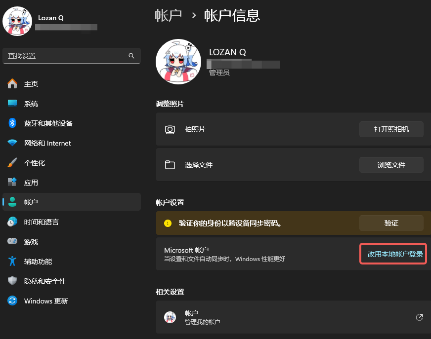
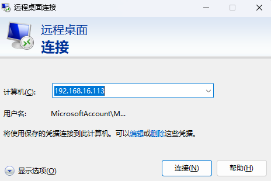
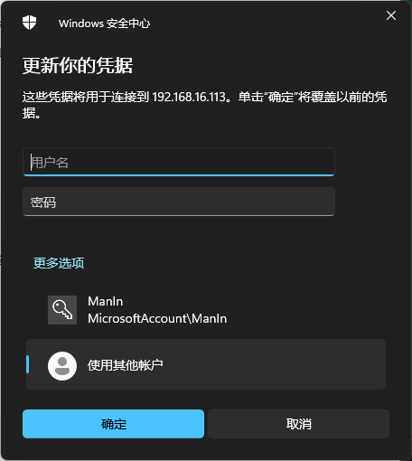

**远程控制**

**概述**

远程控制非常重要

这里没有什么好概述的

**Todesk**

一个新兴企业，被爆出过漏洞，以前秉持免费，现在开始搞收费了，但是轻量使用也不是不行

如果你是个人使用，可以下载
[\[直链\]完整客户端](https://dl.todesk.com/windows/inst.exe)

如果你是分发给其他人使用，建议下载 [\[直链\]
被控端](https://dl.todesk.com/windows/ToDesk_Lite.exe)

使用起来没有什么难度

**向日葵**

老牌远控软件，也被爆出过漏洞，没什么好说的，堪堪可用，不少装机店都会使用向日葵作为远程协助工具。

有Linux版本。

[访问官网](https://sunlogin.oray.com/)

好消息：Todesk和向日葵可以同时远控一台电脑

**RDP**

**RDP协议**

微软为windows研发的远程控制协议和软件

几乎所有的近代windows都支持这个协议且内置了RDP工具

你可以使用搜索框搜索到电脑内的RDP工具

{width="3.0625in"
height="0.5729166666666666in"}

基于TCP协议，同时支持UDP加速，使用3389端口

依靠域名或IP地址进行连接

RDP会根据远控端的桌面大小自适应调整窗体的大小

也就是说，你不需要像Todesk或者向日葵一样用笔记本远控台式机的27吋大屏时盯着那个小小的窗体，非常方便！

**Windows RDP**

**调整配置**

如果你的windows系统在安装后就一直使用在线的微软账号作为登录账号，你需要在连接前创建一个本地账户，否则无法连接（密码什么的都正确但就是拒绝连接）

打开设置 ------ 账户 ------ Microsoft账户 点击改用本地账户登录
，账户名跟你的微软账户名是一样的，然后输入一个密码，等待系统自动切换。切换完成后再回到相同的位置，执行改用微软账户登录
重新登录你的微软账户

{width="5.75in"
height="4.520833333333333in"}

**打开软件**

我们假设你有公网IP地址或者可以公网访问的域名，如果没有，可以在局域网内使用RDP登录

这里使用一个内网的IP地址如下

{width="4.833333333333333in"
height="3.2291666666666665in"}

点击编辑 然后点击使用其他账户 ，输入刚刚看到的本地账户
的名称和密码，默认显示的账户名是你的微软账户，这个账户是无法用于登录的。

{width="4.75in"
height="5.3125in"}

之后点击链接即可

RDP 是独占的，因此你不能在远程时又去登录你的被控电脑

否则会将远控中断

**写在后面**

如果你没有公网IP或者需要在内网以外的地方使用，你需要借助一些网络办法，比如虚拟组网（V.P.N
，这个词的本意如此）或其他的什么方法

这里不能过多赘述

**Linux RDP**

RDP协议也有在Linux上的实现

其中你可以使用XRDP 这个开源实现，不过，XRDP
不是一个足够安全的链接，确保你在安全的网络环境下使用

不过，这需要使用GUI桌面，由于我都使用Linux Server，因此这部分教程略过

**VNC**

[参考文章](https://www.jianshu.com/p/f984bfdcd21e)

**RFB 协议**

RFB
协议是一个通用的指令传输协议，当然也可以传输图像，但是成像效果没有那么好

但是这个协议的软件似乎都需要付费

**硬件控制 \| 旁路控制**

这是一个概念设想，该方案仍然在调研中

源于日常使用Linux过程中。如果系统被玩坏了，就会失去控制，尤其是在配置网络并且没有亮机卡、远程控制时额外有用。

一个简单的实现就是在主服务器旁边加上一个费用较低的瘦终端服务器，然后额外在主服务器上配置一张控制网卡（console）直连瘦终端。

这样即使你把主服务器的出口网络设置玩爆炸了也可以通过远程连接到瘦终端最后跳板到主服务器上进行恢复

但这个有一个问题，如果你把系统玩爆炸了，需要进行恢复，旁路此时会因为网络服务根本没启动（ssh
service也没启动）无法执行控制，即使你将显卡输出使用采集卡连接到瘦终端然后使用X11转发到远控端，也无济于事

因为你需要启动到BIOS界面或者Linux rescure界面进行远程救援

此时可以使用 Teensy \| Ardunio
Zero/Leonado（Teensy开发板很好的集成了keybard emulation功能）
等开发板的HID
功能模拟键盘输入，但这些板子大都昂贵（几百元）。这样在机器启动时可以被识别为键盘并通过瘦终端的远程控制将远程键盘的输入转换为虚拟键盘的输入，最终操控BIOS

在调研的过程中，部分工程师认为可以使用ESP32 的HID 功能实现
